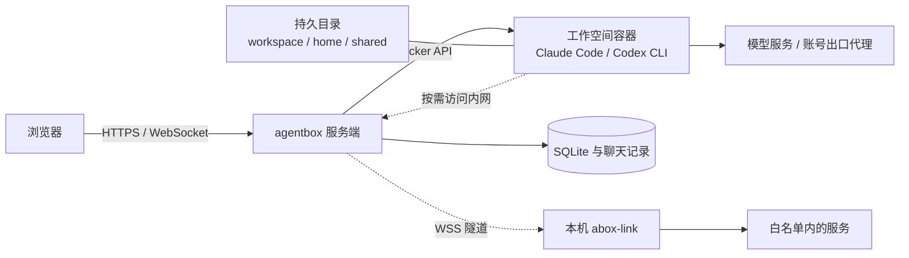

<div align="center">


# agentbox

**打开浏览器，继续你的 AI 编码工作。**

在自己的服务器上运行 Claude Code 与 Codex CLI。<br />
对话、终端、文件与代码审查，共用一个持久化工作空间。

[](go.mod)
[](package.json)
[](images/agent/Dockerfile)
[](internal/store)
[](https://github.com/devilcoolyue/agentbox/actions/workflows/ci.yml)

[快速开始](#快速开始) · [使用文档](#使用文档) · [部署与运维](deploy/README.md) · [反馈问题](https://github.com/devilcoolyue/agentbox/issues)

</div>

## 为什么使用 agentbox？

- **编码环境随时可用。** 浏览器连接云端工作空间，CLI、依赖和代码都留在服务器；工作空间停止后，文件、home 配置和对话历史仍然保留。
- **对话与终端自由切换。** 通过流式对话下发任务，也能打开原版 Claude Code / Codex CLI 的交互终端。终端使用 tmux，网络断线后可重新连接。
- **交付过程集中在一处。** 上传项目、预览和编辑文件、查看 Git diff、提交改动、下载产物，不必反复切换工具。
- **多个工作空间共用资源。** 每位用户拥有自己的 `/shared`，可在不同项目间传递文件；home 模板让技能、MCP 与常用配置复用到多个空间。
- **账号统一管理。** 管理员维护订阅账号、API Key、中转配置和出口代理，用户创建空间时选择对应账号。
- **用量有据可查。** 按用户、空间、模型查看 token 与费用，导出 CSV；管理员可配置价目表、充值和余额拦截。
- **需要时连回内网。** 本机运行 `abox-link`，让云端 Agent 访问白名单内的局域网服务、数据库与内部代码仓库。
- **部署依赖清晰。** 服务端是嵌入前端的 Go 单二进制，使用 SQLite 存储状态，通过 Docker 管理空间，配套 systemd 发布和备份脚本。

## 选择适合你的入口

| 入口 | 适合做什么 | 需要安装什么 |
| --- | --- | --- |
| **浏览器对话** | 下发编码任务、查看流式结果、管理多条对话 | 用户只需浏览器；管理员先部署服务端 |
| **浏览器终端** | 使用原版 CLI、执行命令、安装项目依赖 | CLI 和常用工具已包含在工作空间镜像中 |
| **abox-link 本机面板** | 让云端工作空间访问本机可达的内网 | 在自己的电脑上运行 `abox-link` |
| **abox-link 命令行** | 在无头机器上配置内网白名单与端口映射 | 同一个 `abox-link` 二进制，传入 `--server` |
| **HTTP / WebSocket API** | 接入脚本、管理空间与读取使用记录 | 使用登录后取得的 Bearer token |

`abox-link` 是可选的内网连接工具；普通浏览器使用不需要安装它。

## 工作方式



一个工作空间对应一个容器和一组持久目录；同一空间可以有多条对话线程，但同一时刻只运行一个网页对话回合。用户级共享目录在该用户的所有空间中挂载为 `/shared`。

控制台通过 URL 记录当前页面，例如 `#/usage`（使用记录）、`#/settings/container`（容器设置）、`#/sessions/<空间ID>/files`（空间文件页）。刷新、浏览器前进/后退或收藏链接后重开，都会恢复对应页面、设置分区和空间标签；未登录时先登录再恢复。链接仍受账号权限校验，失效空间或无权访问的页面返回首页。路径使用 `#`，无需额外配置服务端或反向代理。

登录页提供账号、密码图标；密码默认隐藏，点击眼睛按钮可显示或隐藏输入内容，重新进入登录页时恢复隐藏。

侧栏底部的图表图标打开使用记录，位于内网隧道图标前；输入框旁的回形针图标用于添加图片或文件附件。

使用记录、系统设置和内网隧道采用铺满主内容区的布局，桌面标题栏与左侧菜单顶部等高；设置内容与隧道指引在各自内容区内滚动。主控制台滚动条统一使用透明轨道与圆角滑块，随深浅主题切换；终端区域始终采用深色滚动条。

内网隧道生成配对码后会尝试自动复制，也可点击配对码右侧的复制图标再次复制；配对码过期后自动隐藏。

## 快速开始

### 一条命令安装（发布包入口）

在 Linux 服务器上执行：

```bash
curl -fsSL https://raw.githubusercontent.com/devilcoolyue/agentbox-releases/main/install.sh | sudo bash
```

首个正式版本为 [v0.1.0](https://github.com/devilcoolyue/agentbox-releases/releases/tag/v0.1.0)。安装命令默认选择最新正式发布；固定安装此版本可在命令末尾加 `-s -- --version v0.1.0`。

Oracle Linux / RHEL 等启用 SELinux 的系统，若旧版安装包启动时报 `203/EXEC` / `Permission denied`，按[SELinux 安装恢复](deploy/README.md#selinux-安装恢复)修复程序标签后重试激活。

安装器支持 Linux x86_64 / arm64 + systemd；Ubuntu 22.04+、Debian 12+ 自动安装缺失依赖和 Docker，其他发行版需预先安装 Python 3.9+、Git、curl、CA 证书、时区数据和本机 Docker Engine。服务端使用预编译包，无需在服务器安装 Go 或 Node。

命令会校验发布包、构建固定版本工作空间镜像、生成配置和随机管理员密码、安装并启动 `agentbox.service`。首次构建镜像需要几分钟及对镜像仓库、Debian 软件源和 npm 的网络访问。完成后打开 `http://服务器IP:8180`，使用终端显示的 `boxadmin` 和初始密码登录，在「系统设置 → 账号池」添加账号。远程访问需放行防火墙/安全组的 TCP 8180，公网长期使用请配置 HTTPS。

可在命令末尾加 `-s -- --listen 127.0.0.1:8180`，只允许本机或反向代理访问。配置、数据分别存放在 `/etc/agentbox`、`/var/lib/agentbox`。已有部署会停止安装并保留原文件；升级、失败恢复和完整选项见[一键安装说明](deploy/README.md#一键安装)。

以下是开发者从源码安装的步骤。

### 1. 准备 Linux 服务器

| 依赖 | 用途 |
| --- | --- |
| Linux + Docker Engine | 运行服务端与工作空间容器；生产托管使用 systemd |
| Go 1.26.6 或兼容的自动工具链 | 从源码构建服务端，版本以 [go.mod](go.mod) 为准 |
| Git | 拉取源码、Git 变更审查、获取技能市场内容 |
| Python 3、curl、iproute2（`ss`） | 发布、探活和备份脚本 |
| OpenSSL | 生成初始管理员密码 |
| Node.js 22 / npm（可选） | 仅修改主控制台 TypeScript 时需要 |

部署机无需编译前端：`internal/web/static/js/` 的产物已经提交，并随 Go 二进制嵌入。备份由二进制内置 SQLite 在线备份 API 完成，定时脚本的轮转使用 Python 3。

每个容器默认限制为 **2048 MiB 内存、2 CPU、512 个进程**；按并发空间数为服务器预留资源。macOS 可用于构建和单元测试，完整容器与 systemd 部署以 Linux 为目标。

### 2. 获取源码并构建

```bash
git clone https://github.com/devilcoolyue/agentbox.git
cd agentbox

go build -o agentbox ./cmd/agentbox
./scripts/build-image.sh
```

镜像构建需要访问基础镜像仓库、Debian 软件源和 npm。构建用户应有 Docker 访问权限；服务启动时还需要为挂载目录设置 `1000:1000` 属主，配套 systemd 单元以 root 运行。

### 3. 初始化配置

```bash
cp config.example.json config.json
openssl rand -hex 24
```

编辑 `config.json`：

1. 将 `auth_token` 换成刚生成的随机字符串，它是首次启动时 `boxadmin` 的初始密码。
2. 初次体验可将 `accounts` 与 `proxies` 都设为 `[]`，登录后从网页添加真实账号。示例中的代理地址与密钥均为占位内容，不能直接使用。
3. 保留 `listen: "127.0.0.1:8180"`，数据默认写入配置文件所在目录下的 `data/`。

可直接使用以下最小配置，先替换密码占位符：

```json
{
  "listen": "127.0.0.1:8180",
  "auth_token": "CHANGE_ME_TO_A_LONG_RANDOM_TOKEN",
  "data_dir": "data",
  "agent_image": "agentbox-agent:latest",
  "accounts": [],
  "proxies": []
}
```

密码占位符会被启动校验拒绝。完整字段、默认值与生效时机见[配置参考](docs/configuration.md)。

### 4. 启动并登录

在 Linux 服务器的仓库目录前台试跑：

```bash
sudo ./agentbox -config config.json
```

服务器本机访问 **<http://127.0.0.1:8180>**。若服务器在远端，可以在自己的电脑另开终端，通过 SSH 转发访问：

```bash
ssh -N -L 8180:127.0.0.1:8180 user@your-server
```

然后在本机浏览器打开相同地址，使用 **`boxadmin` + 配置中的 `auth_token`** 登录。首次建号以后，密码保存在数据库中，修改 `auth_token` 不会重置登录密码。

### 5. 添加账号，创建第一个空间

1. 打开「系统设置 → 账号池」，新增 Claude 或 Codex 账号。
2. 在同一弹窗选择「订阅 OAuth」或「API Key / 中转」，同时配置名称、使用范围与出口代理。Claude 订阅粘贴授权码；Codex 订阅粘贴完整回调地址；API / 中转账号填写地址与 Key。具体见[账号与模型](docs/accounts-and-models.md)。
3. 点击创建工作空间，填写名称，选择 Agent 与账号。
4. 在「文件」页上传项目，或打开「终端」执行 `git clone`。
5. 在「对话」页发送任务；完成后到「变更」页审查 diff，再提交或下载文件。

### 6. 转为长期运行

结束前台试跑后，在仓库目录执行：

```bash
sudo ./deploy/install.sh
sudo ./deploy/deploy.sh
```

管理员登录后，侧栏 AGENTBOX 名称下方显示服务端版本。点击版本可查看更新状态，并跳转「系统设置 → 关于与更新」。页面可见且联网时每 4 小时自动检查 GitHub 正式发布；发现更高版本时徽标和提示变为黄色。手动检查共用服务端缓存，最短间隔 1 分钟；检查失败会保留上次结果并提示错误。开发构建（`dev` / dirty）不推断可升级状态，也不显示“已是最新”。这里只检查并提示，实际升级按[发布说明](docs/releases.md#升级与回退)由管理员完成。

`install.sh` 安装服务、镜像更新与备份定时器；`deploy.sh` 构建、替换二进制、重启并探活。远程长期访问请配置 HTTPS 与 WebSocket 反向代理，完整步骤见[部署与运维](deploy/README.md)。

## 用户与权限

| 能力 | 普通用户 | 管理员 |
| --- | --- | --- |
| 创建空间、对话、终端、文件与技能管理 | 自己的空间 | 自己的空间 |
| 使用共享目录、用户 home 模板、内网隧道 | 自己的资源 | 自己的资源 |
| 选择账号池中的账号 | 仅授权范围内 | 全部账号 |
| 查看使用记录 | 自己的记录 | 全部用户的记录 |
| 管理账号凭证、出口代理、模型、价格与系统配置 | 不可以 | 可以 |
| 创建用户、重置用户密码、管理额度 | 不可以 | 可以 |

账号池由管理员统一维护，每个账号支持「全体用户」「指定用户」「仅管理员」三种使用范围，在账号行的「使用范围」按钮设置。旧配置未设置范围时保持全体共享；管理员始终可用。管理员的工作空间 API 同样受属主校验；系统管理权限不提供跨用户的空间浏览入口。服务器管理员仍可直接访问宿主机持久数据。

撤销账号授权会阻止新操作和后续凭证同步，已交付的凭证及已启动的进程不会自动撤回；彻底撤销还需停止相关容器并在上游轮换凭证。账号凭证会提供给容器内的 CLI，拥有终端访问权的用户可以读取这些凭证。因此，共享账号池适用于可信用户；不要将管理员的订阅或 API 凭证分享给不可信用户。

## 当前支持范围

| 能力 | Claude Code | Codex CLI |
| --- | --- | --- |
| 网页对话与多线程历史 | 支持，使用流式无头回合 | 支持，优先 app-server，握手失败时回退 exec |
| 原版 CLI 终端 | 支持 | 支持 |
| 网页订阅授权 | 支持 OAuth 授权码流程 | 支持 OAuth 回调地址流程 |
| API Key / 中转配置 | 支持 | 支持，需匹配 provider 协议 |
| 网页对话与自动起标题用量 | 支持 | 支持；费用需按价目表折算 |
| 终端用量补记 | 支持，只记录、不扣余额 | 支持 codex-tui rollout，只记录、不扣余额 |
| 网页技能管理 | 支持 `.claude/skills` | 使用 CLI 和 home 模板配置 |

还有几项使用边界：

- **文件持久化不等于进程持久化。** 终端网络断开可续接；停止或重建容器会终止其中进程。应把需要保留的内容放在 `/workspace`、`/home/agent` 或 `/shared`。
- **额度不是实时硬上限。** 网页回合结束时结算，余额见底的这一轮可能超支；Claude/Codex 终端补记都不扣余额。
- **默认系统备份不包含工作区。** 系统备份覆盖数据库、配置、账号凭证与双层模板；`agentbox backup --full` 额外覆盖用户文件和历史，需要先停止服务及相关容器。提供 `backup-verify` 校验和 `restore --to` 恢复到新目录，见[备份与恢复](deploy/README.md#备份与恢复)。
- **生产发布会短暂断开连接。** 当前采用单机、单服务进程与本机 Docker，同一 `data_dir` 只允许一个 agentbox 进程。
- **容器允许 Agent 执行代码。** 默认权限模式为 `bypassPermissions`。容器以非 root 用户运行，设置资源限制与 `no-new-privileges`；服务端具有 Docker 权限，适合由可信管理员部署和维护。
- **Git 审查在会话容器内执行。** 进入审查会按需启动空间，并遵循终端相同的额度入口限制；网页提交不执行 Git hook 或签名，需要这些功能时请在终端提交。
- **网页文件操作不沿符号链接访问。** 工作区、共享目录、技能和凭证文件使用受限目录句柄；上传先在临时目录验证，编辑器保存以原子替换方式写入。模板中的链接仍可由容器内 CLI 使用。

## 使用文档

详细文档均为中文，也可以从[文档目录](docs/README.md)按角色开始阅读。

| 文档 | 内容 |
| --- | --- |
| [工作空间使用指南](docs/user-guide.md) | 对话、终端、文件、HTML 预览、Git 审查与共享目录 |
| [账号与模型](docs/accounts-and-models.md) | OAuth、API Key、Codex 凭证、默认模型与账号生命周期 |
| [配置参考](docs/configuration.md) | 配置字段、默认值、持久目录与生效时机 |
| [技能、插件与 MCP](docs/skills-and-mcp.md) | 技能页、官方市场、双层 home 模板与 MCP 配置 |
| [使用记录与额度](docs/usage-and-quotas.md) | 统计口径、费用明细、价目表、充值、超支行为与 CSV |
| [出口代理与内网隧道](docs/networking.md) | 代理池、abox-link 配对、白名单、端口映射与环境变量 |
| [部署与运维](deploy/README.md) | systemd、HTTPS、更新、备份恢复、迁移与日志 |
| [API 参考](docs/api.md) | 登录、工作空间、文件、聊天、用量与管理接口 |
| [开发指南](docs/development.md) | 仓库结构、构建、前端热加载、测试与贡献约定 |
| [开源重构设计](docs/architecture/opensource-refactor.md) | 模块边界、目录迁移、分阶段实施与验收进度 |
| [常见问题](docs/troubleshooting.md) | 启动、登录、容器、代理、用量、备份与前端排障 |

## 技术栈与本地开发

| 层次 | 技术 |
| --- | --- |
| 服务端 | Go、HTTP / WebSocket、Docker Engine API |
| 主控制台 | TypeScript、原生 ES Modules、xterm.js、KaTeX |
| 持久化 | SQLite、宿主机文件目录、JSONL 聊天记录 |
| 工作空间 | Debian / Node.js 镜像、Claude Code、Codex CLI、tmux |
| 内网连接 | abox-link、yamux、WebSocket、SOCKS5 与 TCP 映射 |
| 部署 | Linux、systemd、HTTPS 反向代理 |

```bash
go build ./...
go test ./...

# 修改前端时执行；CI 使用 Node.js 22
npm ci
npm run check
npm run build
```

修改 `web/src/*.ts` 后必须一起提交 `internal/web/static/js/` 的构建产物。Linux 容器验证、可选真实模型测试与 abox-link 构建见[开发指南](docs/development.md)。

贡献步骤见 [CONTRIBUTING.md](CONTRIBUTING.md)，漏洞私密报告见 [SECURITY.md](SECURITY.md)，变化记录见 [CHANGELOG.md](CHANGELOG.md)，第三方许可见 [third_party/](third_party/README.md)。二进制候选包与安装流程见 [发布说明](docs/releases.md)，固定 CLI 版本见 [兼容矩阵](docs/compatibility.md)。

欢迎提交聚焦具体问题的 Issue 或 PR。反馈时附上平台、代码提交版本、复现步骤和脱敏日志；真实凭证、用户文件与数据库不要放入提交或截图。

## 许可证

Agentbox 采用 [Apache-2.0](LICENSE)，版权声明见 [NOTICE](NOTICE)。第三方组件保留各自许可；模型服务和运行时 CLI 的使用与再分发遵循其上游条款，详见 [第三方说明](third_party/README.md)。

服务收到 SIGINT/SIGTERM 后停止接收新任务，给在途聊天回合最多 2 秒请求中断并收尾，然后取消后台任务、断开 WebSocket/代理/隧道连接，等待已接收用量落库后释放数据库和数据目录锁。重启不会停止会话容器或终端 tmux；不能将服务退出等同于容器内进程全部终止。

工作空间的创建、启停、删除与空闲回收由统一工作区服务协调；容器停止或删除失败会返回错误并保留记录，避免界面显示成功但容器仍在运行。

凭证刷新、同步与保存由独立凭证服务管理，并按账号串行。成功续期后立即播发到有授权的已有会话，不再被日常同步的时间戳容差跳过。

用量归一化、定价与终端扫描已集中到 `internal/usage`。新记录保存入账价格快照；SQLite 使用事务化版本迁移，遇到更高 schema 版本会拒绝打开。升级前请验证备份，旧二进制回退限制见 [数据库迁移说明](docs/architecture/database-migrations.md)。

## 独立部署与运行维护

新安装可使用版本化发布目录，配置、数据和市场缓存分别放在 `/etc/agentbox`、`/var/lib/agentbox`、`/var/cache/agentbox`；仓库内部署继续兼容。[部署目录与迁移手册](docs/architecture/deployment-layout.md) 包含安装、升级、回退、离线迁移与备份步骤。

系统设置的「容器与资源」支持全局/每用户运行容器上限、数据盘保留空间、后台磁盘统计、市场缓存清理与脱敏诊断下载。用量页读取已入账记录并显示终端扫描时间，补记在后台完成。
