<div align="center">


# agentbox

**Your AI coding workspace. On your server. In your browser.**

Run Claude Code and Codex CLI on a Linux server you control.<br /> Go from a task to reviewed code with chat, terminal, files, and Git in one place.

[](https://github.com/devilcoolyue/agentbox/releases/latest) [](go.mod) [](images/agent/Dockerfile) [](LICENSE)

**English** | [简体中文](README_CN.md)

[Quick start](#quick-start) · [Watch the tour](#see-the-workflow) · [Screenshots](#screenshots) · [Architecture](#how-it-works) · [Documentation](#documentation)

</div>

<a href="docs/images/chat-dark.png">
  <picture>
    <source media="(prefers-color-scheme: light)" srcset="docs/images/chat-light.png" />
    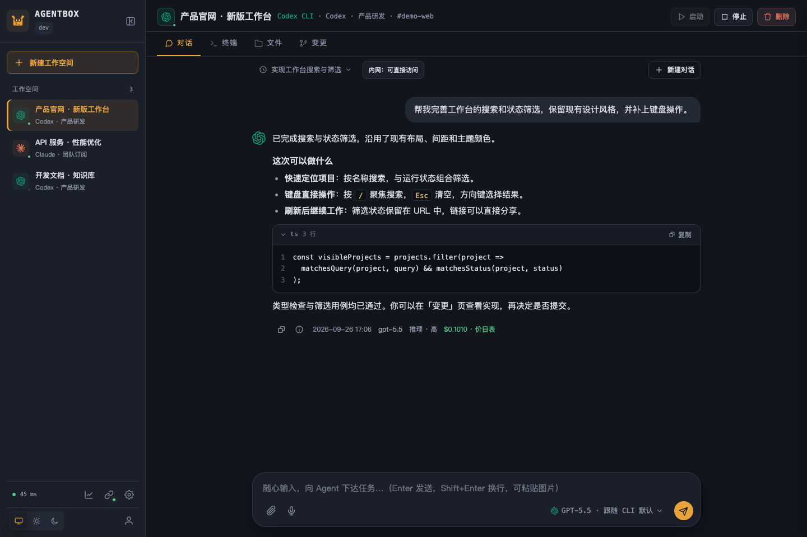
  </picture>
</a>

<p align="center"><sub>One workspace for the whole task. Open any screenshot to inspect it at full resolution.</sub></p>

## Why agentbox?

Set up your coding environment once on your server, then pick up your project from a laptop, desktop, or phone. Your local machine only needs a browser; the agents and project tools run in Docker on the server.

| What you need | What agentbox provides |
| --- | --- |
| **Pick up where you left off** | Persistent project files, home configuration, and chat history across browser sessions |
| **Work with familiar agents** | Claude Code and Codex CLI, with streaming Web chat and their original interactive terminal interfaces |
| **Finish the task in one place** | Upload or clone → chat → run and preview → review diffs → commit, push, or download |
| **Reuse your setup** | User-level shared files, layered home templates, Claude skills, and MCP configuration with workspace overrides |
| **Give a trusted team access** | Central account pools, per-user account scopes, usage records, historical prices, and optional credit limits |
| **Connect to your own services** | Optional abox-link tunnel to allowlisted repositories, databases, and other private-network services |

You bring the server and your own Claude / Codex subscription, API key, or compatible relay account. Agentbox provides the workspace and management layer; model usage follows your provider's terms and pricing.

## See the workflow

**Chat → terminal → Git review → previews.** The GIF introduces the core workspace; the 34-second MP4 also visits skills, MCP, usage, and private-network access.

[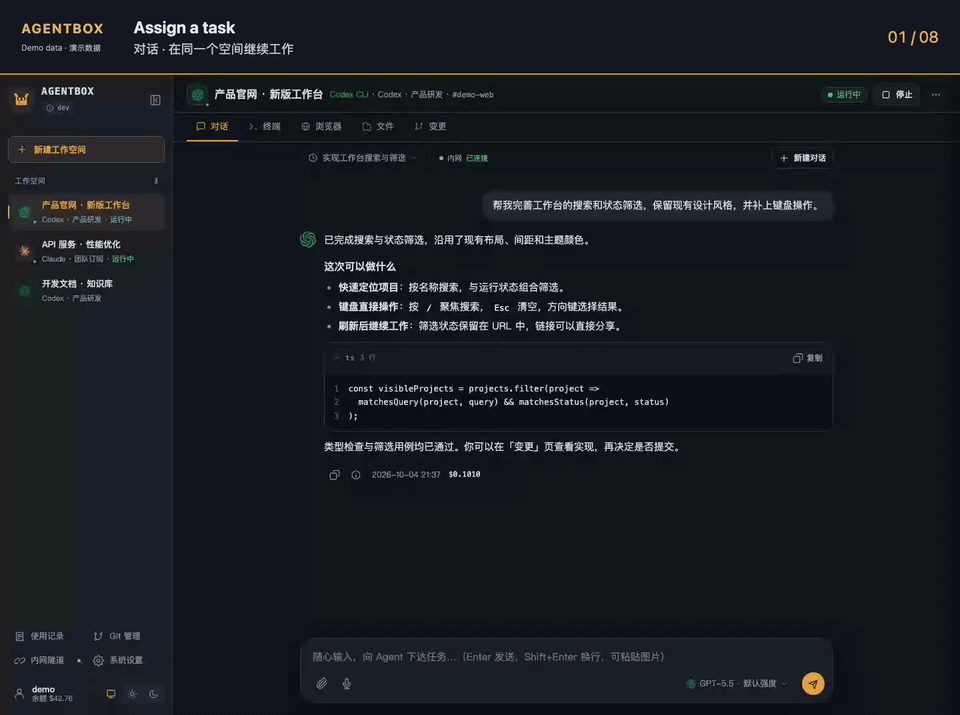](docs/media/agentbox-tour.mp4?raw=1)

<p align="center"><a href="docs/media/agentbox-tour.mp4?raw=1"><strong>Download the full-resolution MP4</strong></a> · <a href="#screenshots">Browse full-resolution screenshots</a></p>

<sub>Screenshots use 2× pixel density. All media is captured from the actual browser UI with synthetic projects, conversations, command output, and usage records. These are interface demonstrations, not live model benchmarks. The media was captured before multilingual support was added and shows the Chinese interface; v0.1.10 also supports Traditional Chinese and English.</sub>

## Interface languages

The **Web console and abox-link v0.1.10** support **简体中文 · 繁體中文 · English**. Choose a language on the login page, in the Web console’s user menu, or at the top of the abox-link panel. The default follows your browser/system language, falling back to English when unsupported; explicit choices are saved on the current device.

Switch immediately while keeping drafts and terminal connections. User content, model responses, terminal output, and server diagnostics remain in their original language. [Language behavior and desktop availability →](docs/i18n.md)

## Quick start

### Install on your Linux server

```bash
curl -fsSL https://raw.githubusercontent.com/devilcoolyue/agentbox/main/install.sh | sudo bash
```

The installer downloads and verifies the server package, builds the workspace image, and starts `agentbox.service`. **No Go or Node.js installation is needed on the server.** The first image build takes a few minutes and needs access to container registries, Debian repositories, and npm.

- **Host:** Linux x86_64 / arm64, systemd, and local Docker Engine. Ubuntu 22.04+ / Debian 12+ install missing dependencies automatically. For other distributions, see the [prerequisites](deploy/README.md#一键安装).
- **Sign in:** open `http://YOUR_SERVER_IP:8180` and use `boxadmin` with the generated password printed by the installer. Allow TCP 8180 through your firewall if connecting directly; configure [HTTPS](deploy/README.md#https-与-websocket-反向代理) for ongoing public access.
- **Stable server:** [v0.1.11](https://github.com/devilcoolyue/agentbox/releases/tag/v0.1.11). The command selects the latest stable release; append `-s -- --version v0.1.11` to pin it, or `-s -- --listen 127.0.0.1:8180` to bind only to localhost.
- **Existing installation:** use the console's update entry or the [upgrade guide](docs/releases.md#升级与回退). The installer preserves existing deployments and will not overwrite them.

Configuration lives in `/etc/agentbox`, data in `/var/lib/agentbox`. Each workspace defaults to a 2 GiB memory limit and 2 CPUs; size your server for the number of concurrent workspaces. See [installation and recovery](deploy/README.md#一键安装) for all options.

### Your first task

The workspace uses a one-time, three-step tour with Skip and replay under More → Quick tour. It does not reserve workspace space. Workspace filters share one row, and draft settings live in the composer toolbar.

v0.1.11 adds a role-based first-use guide: administrators check the environment, connect accounts and review defaults; users see their authorized accounts. Workspace creation refreshes access and disables submission when no account is available. See [M2 progress](docs/milestones/m2.md); this release supports empty, upload and Git project creation with persistent receipts. See [project import and recovery](docs/project-creation.md); creation receipts were introduced in schema 11, and this release also includes schema 12 chat receipts.

The UI also confirms workspace configuration and offers an editable first-task example. About and updates distinguishes server, Agent image and desktop updates, including version observations and restart scope; see [update components](docs/update-components.md). Desktop UI changes require a separate desktop release.

v0.1.11 adds isolated recovery of unsent chat drafts and attachment checks. It also introduces server schema 12 and a versioned chat receipt API connected to the existing runner, with ID deduplication, status queries and recovery after restart. The browser now saves a frozen outgoing copy before sending, queries the original ID after a lost acknowledgement, and provides explicit result review. Unsent drafts stay separate. Local saving can be disabled; older servers retain the legacy send path with a capability notice. Back up before upgrading; older schema 10/11 binaries cannot open schema 12. See [draft recovery](docs/chat-recovery.md) and [M3 progress](docs/milestones/m3.md).

1. **Add an account** in System settings → Account pool (`系统设置 → 账号池`). Choose Claude or Codex and connect a subscription or API / relay account. [Account setup →](docs/accounts-and-models.md)
2. **Create a workspace** and select its agent and account.
3. **Bring your project:** upload files, or open Terminal and clone a repository into `/workspace`.
4. **Describe the task in Chat**, then inspect files or run commands in Terminal. Both work on the same project files.
5. **Review Changes** before committing. Download the result, or configure a Git connection to push and open a PR / MR. [Workspace guide →](docs/user-guide.md)

<details>
<summary><strong>Prefer to build from source?</strong></summary>

On Linux with Docker, Git, and the Go toolchain in [go.mod](go.mod):

```bash
git clone https://github.com/devilcoolyue/agentbox.git
cd agentbox
go build -o agentbox ./cmd/agentbox
./scripts/build-image.sh
openssl rand -hex 24
```

Save the following as `config.json`, replacing the password placeholder with the generated random value:

```json
{
  "listen": "127.0.0.1:8180",
  "auth_token": "CHANGE_ME_TO_A_LONG_RANDOM_TOKEN",
  "data_dir": "data",
  "agent_image": "agentbox-agent:latest",
  "accounts": [],
  "proxies": []
}
```

```bash
sudo ./agentbox -config config.json
```

Open `http://127.0.0.1:8180` on the server, or run `ssh -N -L 8180:127.0.0.1:8180 user@your-server` on your computer and open that address locally. Sign in as `boxadmin` with the configured `auth_token`. After first startup the password is stored in the database; editing `auth_token` does not reset it.

Forgot the administrator password? The current source adds `agentbox admin-reset-password --config /path/to/config.json --user boxadmin`: stop the service and verify a backup first, then enter the new password twice in a terminal. It revokes that administrator’s login tokens and preserves workspace and billing data. See the [recovery procedure](docs/troubleshooting.md#忘记密码或改了-auth_token-仍不能登录); older release binaries may not include the command.

The server needs Docker access and permission to set mounted directory ownership to `1000:1000`. After stopping this foreground instance, run `sudo ./deploy/install.sh` and `sudo ./deploy/deploy.sh` for a source-based systemd installation. See [deployment](deploy/README.md), [configuration](docs/configuration.md), and [development](docs/development.md) for details.

</details>

## How it works

**One Go server, SQLite, and Docker.** The frontend is embedded in the server binary. Each workspace gets its own container; files and history persist on the host.

[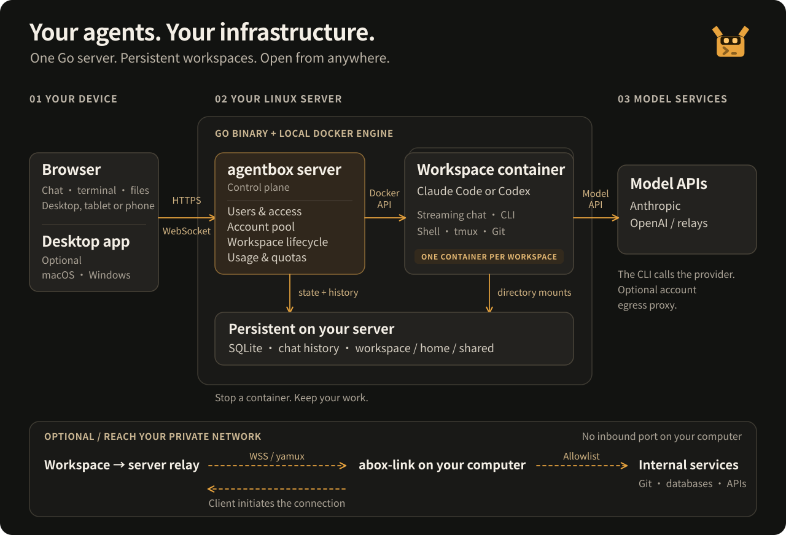](docs/images/architecture.svg)

| Layer | Responsibility |
| --- | --- |
| **Browser / optional desktop** | Connect to the server and interact with your workspaces |
| **Agentbox server** | Authentication, account access, workspace lifecycle, HTTP / WebSocket, Git operations, usage and credits |
| **Workspace containers** | Run Claude Code / Codex CLI and project tools; communicate with your configured model provider |
| **Persistent storage** | SQLite state and ledger, project files, home directories, shared files, and JSONL chat history |
| **Optional abox-link** | Connect private services reachable from your computer through an explicit allowlist |

Chat and terminal share files, **not an automatic conversation context**. Each workspace supports multiple chat threads and one active Web chat turn at a time. Each user's `/shared` directory is available across their workspaces. Stopping a container retains files and history but ends its processes.

## Screenshots

### Use the original CLI when you want direct control

Switch to a Shell, Claude Code, or Codex CLI terminal. Run tests, install dependencies, and reconnect to the same tmux session after a network disconnect while the container remains running.

[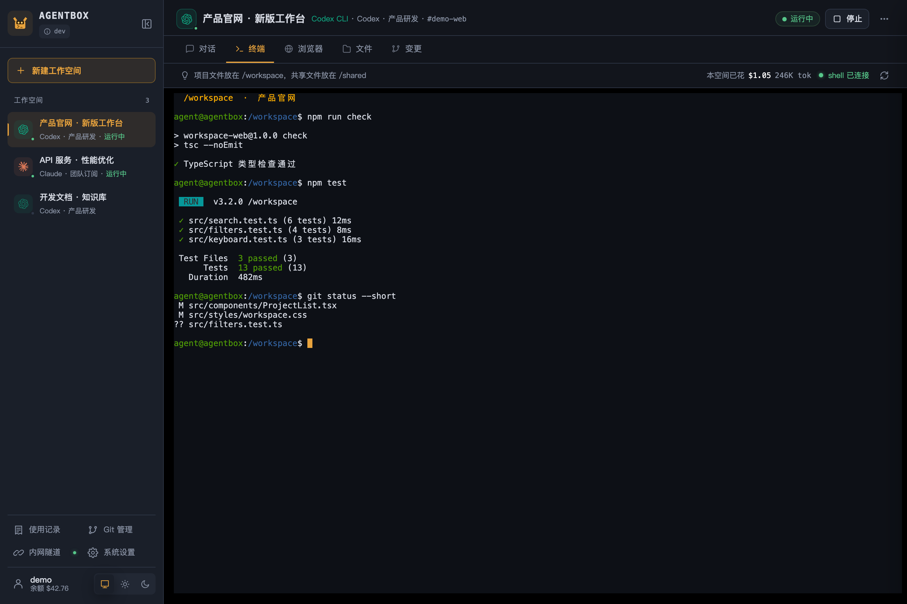](docs/images/terminal.png)

### Review what changed before you ship

Inspect the file list and diffs, then commit the repository’s changes. Connect repositories with HTTPS tokens, SSH, or configured GitHub / GitLab OAuth; fetch, pull, preview a push, and create a PR / MR from the Web UI.

[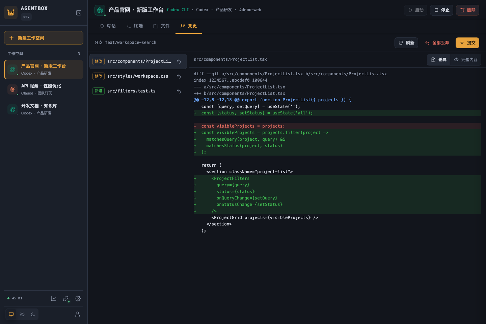](docs/images/changes.png)

### See where the usage goes

Filter by time, user, agent, and model. Inspect token counts, recorded costs, pricing snapshots, and response latency; export records to CSV. Administrators can manage pricing and credit balances.

[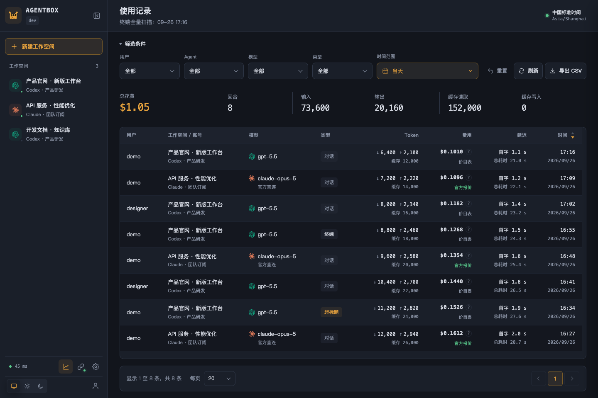](docs/images/usage.png)

<details>
<summary><strong>Files and document previews</strong></summary>

Browse, edit, upload, and download from project and shared directories. The source viewer includes syntax highlighting, line numbers, and fullscreen mode. Switch between source and rendered Markdown or HTML to inspect generated documents and pages.

[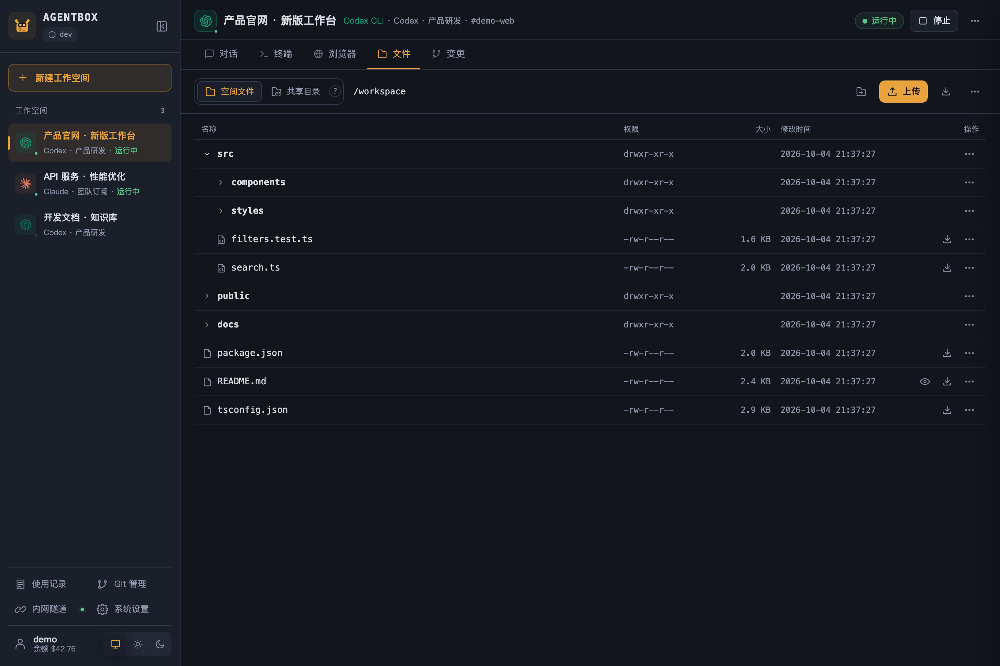](docs/images/files.png)

[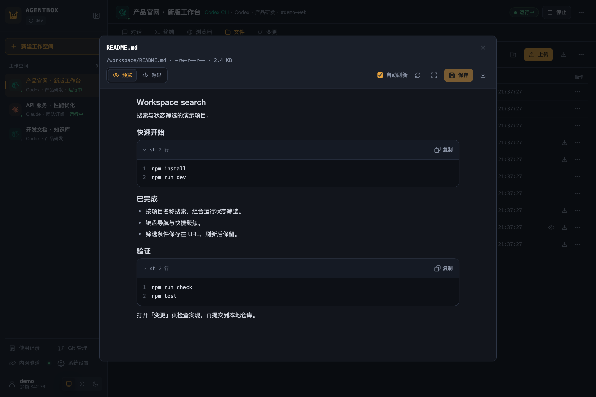](docs/images/preview.png)

</details>

<details>
<summary><strong>Reusable skills and MCP tools</strong></summary>

Manage Claude skills in a workspace or user template. Configure MCP user defaults and workspace overrides, import JSON, and test connections from the container. Codex skills and MCP are configured through its CLI.

[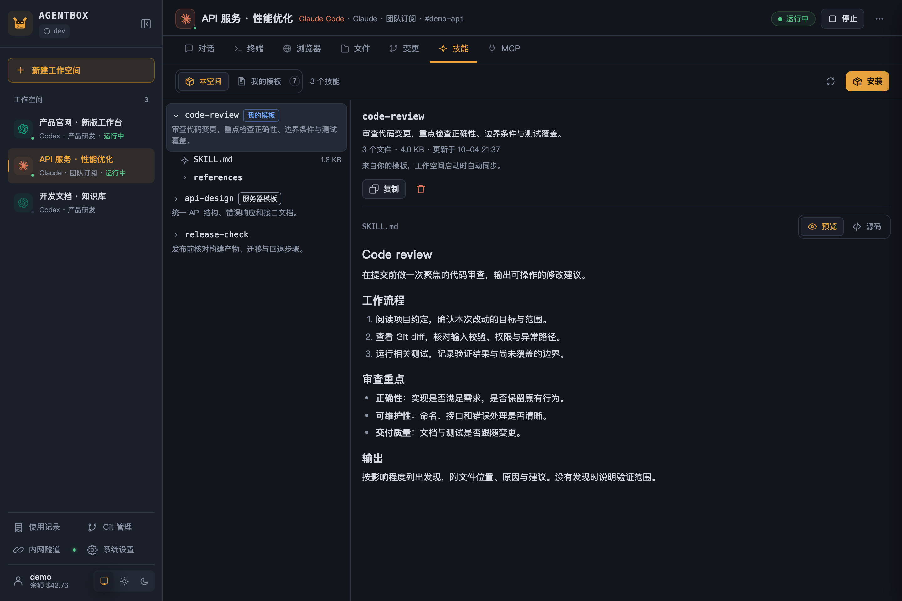](docs/images/skills.png)

[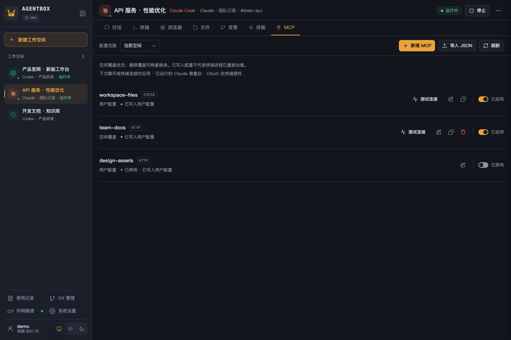](docs/images/mcp.png)

</details>

<details>
<summary><strong>Account pools and private-network access</strong></summary>

Keep subscription, API key, and relay accounts in one pool with access scopes. Pair abox-link when your workspace needs to reach an allowed service on your local or company network.

[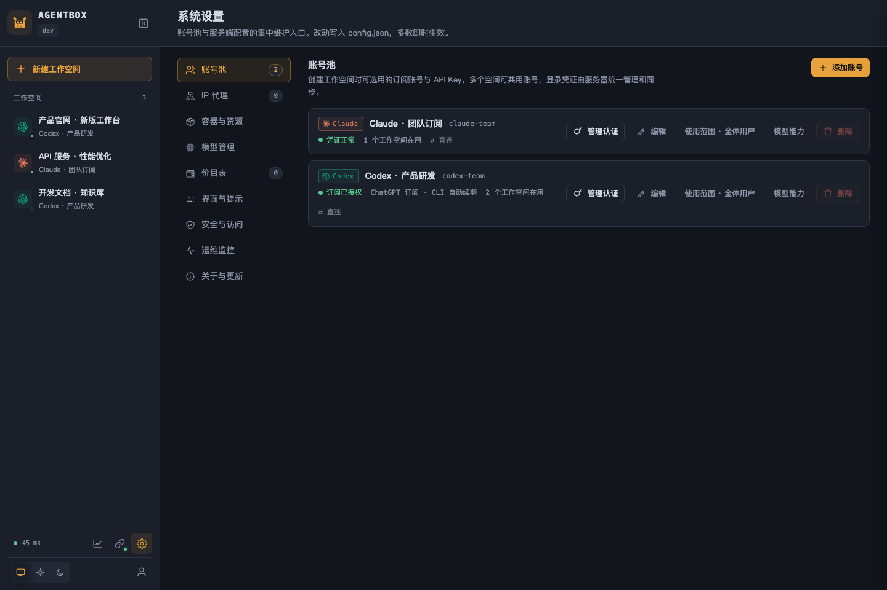](docs/images/accounts.png)

[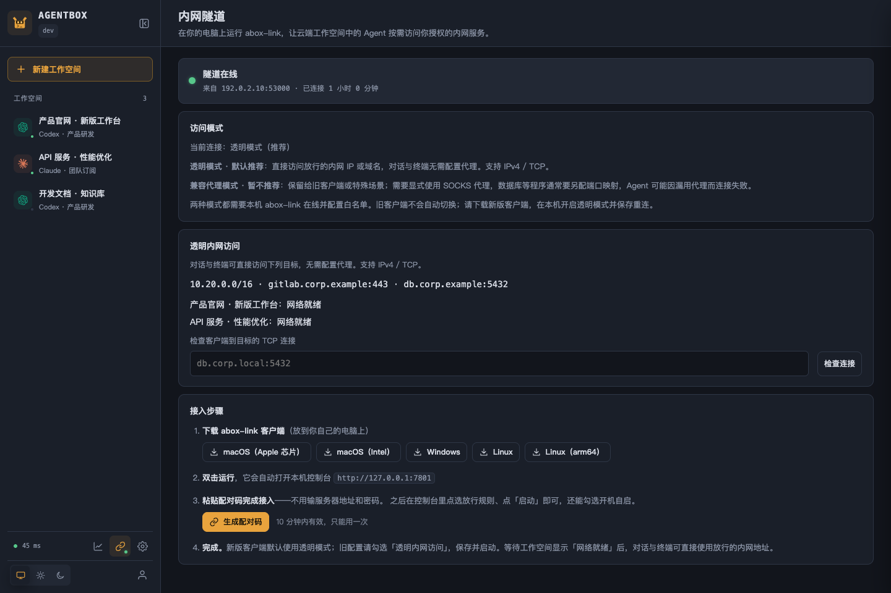](docs/images/tunnel.png)

</details>

<details>
<summary><strong>Light theme and mobile access</strong></summary>

Choose light, dark, or system themes. Phone layouts include drawer navigation and a touch terminal shortcut bar, with scrolling and long-press paste.

[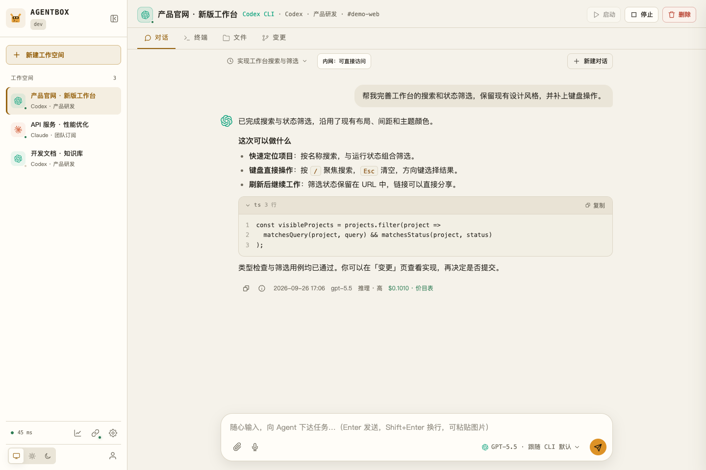](docs/images/chat-light.png)

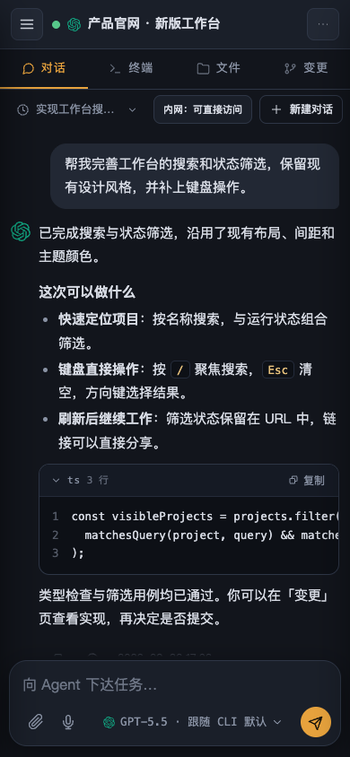

</details>

The [capture guide](docs/development.md#文档截图) explains how to reproduce the screenshots and tour with demo data.

## Choose your entry point

| Entry point | Use it for | Availability |
| --- | --- | --- |
| **Web console** | Chat, original CLI terminal, files, Git, skills, MCP, and administration | Included in the server; no local agent installation |
| **Desktop app** | Native Windows/macOS access, project terminals, file transfer, and optional sync | [Download 0.1.2](https://github.com/devilcoolyue/agentbox/releases/tag/desktop-v0.1.2) · unsigned public test release |
| **abox-link** | Allowlisted private-network access from cloud workspaces | Optional; local panel or headless command line on Windows, macOS, and Linux |
| **HTTP / WebSocket API** | Script workspace operations and usage queries | [API reference](docs/api.md) |

The desktop app has packages for Mac Apple Silicon, Mac Intel, and Windows x64. It connects to your server; it does not replace or upgrade it. Server v0.1.8 provides basic mode; v0.1.9 adds project terminals, pairing, and the sync backend. **Sync is disabled by default and requires an administrator to enable it.** Desktop 0.1.2 is a manual download: macOS is not notarized, Windows is unsigned, and automatic updates are not enabled. This server release does not update the desktop installer: published Desktop 0.1.2 does not include multilingual UI, while the current desktop source does. See the [desktop guide](desktop/README.md) for source, setup, and validation limits.

An optional [remote browser image](docs/remote-browser.md) adds a full browser desktop inside a workspace, with persistent website login, clipboard support, and downloads. It is separate from CLI authorization and requires the browser-enabled image.

## Know the boundaries

- **Use trusted accounts with trusted users.** Credentials are made available to the CLI inside containers and can be read by users with terminal access. Account scopes restrict admission; revoking access does not withdraw credentials already delivered or terminate existing processes. See [account permissions](docs/accounts-and-models.md#账号使用范围).
- **Persistent files are not persistent processes.** Keep durable files in `/workspace`, `/home/agent`, or `/shared`. Stopping, rebuilding, or idle suspension ends container processes; a browser disconnect alone does not immediately stop the container.
- **Credits are not hard spending caps.** Web chat settles after each turn and may overspend on the final admitted turn. Supported terminal usage is recorded without deducting credits. See [usage and quotas](docs/usage-and-quotas.md).
- **Back up user files explicitly.** Default system backups cover configuration, credentials, database state, templates, and MCP management state; they exclude workspace files and chat history. Full backups require stopping the service and relevant containers. See [backup and restore](deploy/README.md#备份与恢复).
- **Deploy within a trusted server boundary.** Agentbox uses a local Docker daemon and one server process per data directory. Agents execute code with `bypassPermissions` by default; containers use a non-root user and resource limits. Deployments briefly disconnect clients.
- **Review and push are separate actions.** Web commits do not run hooks or signing and do not automatically push. Use the terminal when you need those commit behaviors. See [Git management](docs/architecture/git-management.md).

## Documentation

English and Chinese READMEs cover the same overview and setup. Detailed guides are currently in Chinese; start with the [documentation index](docs/README.md).

| You want to… | Read |
| --- | --- |
| Use chat, terminal, files, previews, and Git | [Workspace guide](docs/user-guide.md) |
| Connect accounts or choose models | [Accounts and models](docs/accounts-and-models.md) |
| Reuse skills, templates, and MCP tools | [Skills, plugins, and MCP](docs/skills-and-mcp.md) |
| Understand or manage costs | [Usage and credits](docs/usage-and-quotas.md) · [Pricing catalogs](docs/pricing-catalog.md) |
| Connect private services | [Proxies and abox-link](docs/networking.md) |
| Install, upgrade, back up, or recover | [Deployment](deploy/README.md) · [Releases](docs/releases.md) · [CLI compatibility](docs/compatibility.md) |
| Configure or integrate the server | [Configuration](docs/configuration.md) · [API reference](docs/api.md) |
| Choose an interface language | [Languages and preferences](docs/i18n.md) |
| Resolve an error | [Troubleshooting](docs/troubleshooting.md) |
| Contribute code | [Development guide](docs/development.md) · [Contributing](CONTRIBUTING.md) |

## Development roadmap

The server and Web console changes from the first round (M1–M5) are included in v0.1.11, but external acceptance—real-user observations, performance thresholds, recovery targets, and desktop signing—is still pending; see the [first-round record](docs/milestones/backlog.md). The second round (M6–M10) starts on 2026-10-06: first turn the development build into a proper release, then add real-use acceptance and metrics collection, improve daily efficiency based on real feedback, reduce upstream update and installation cost, and finally deliver a stable desktop release if certificates are available. Scope, dependencies, and acceptance are in the [second-round plan](docs/roadmap-2.md) (Chinese).

The current web console source includes translated recovery hints and operation IDs for login, workspace startup, and chat failures; existing clients can still read the `error` field. See the [error contract](docs/errors.md) for scope and limitations. Administrators can run instance environment checks; users can check their own workspaces. Results distinguish passed, failed, and unchecked items, and never claim model availability without a model call. See [layered diagnostics](docs/diagnostics.md).

| Milestone | Planned focus |
| --- | --- |
| **M1 · Troubleshooting and maintenance baseline** | Consistent error codes and operation IDs, expanded environment diagnostics, administrator password recovery, and clearer documentation and test entry points |
| **M2 · First use and project import** | Setup guidance by role, a connected workspace creation and upload/Git import flow, and clear version and update behavior |
| **M3 · Reliable daily tasks** | Chat drafts and receipt acknowledgments, idempotent message acceptance, task status checks after disconnects, and workspace search and filters |
| **M4 · Maintenance and upgrade quality** | Further separation of complex modules, API contracts and layered CI, CLI protocol compatibility checks, and upgrade and recovery validation |
| **M5 · Stable desktop release and consistency across clients** | OS signing and notarization, real-device and older-package upgrade acceptance, a multilingual desktop release, and a small sync pilot |
| **M6 · Wrap-up and formal release** | Commit the development tree, run hosted CI end to end, release server v0.1.11 and desktop 0.1.3 test build, align documented version status |
| **M7 · Real-use acceptance and metrics baseline** | In-instance aggregate metrics with redacted export, real task observations, agreed performance thresholds and recovery targets, production-data recovery drill |
| **M8 · Feedback-driven daily efficiency** | Fix the most frequent blockers found in observations; candidates: workspace archiving, task completion notifications, long-conversation rendering |
| **M9 · Upstream updates and installation cost** | Prebuilt Agent images, CLI baseline advancement, routine dependency upgrades, broader contract generation |
| **M10 · Stable desktop release** | OS signing and notarization, minimum OS and real devices, a full sync pilot cycle; downgraded to a test release if certificates are unavailable |
| **M11 · Additional agents** | Provider registry and ACP transport, optional agents in the image; Kimi Code CLI first, dsh / Antigravity as candidates depending on protocol maturity |

Each iteration is initially scoped to **3 weeks**. Order and scope may change with user feedback, maintainer availability, and acceptance results; these estimates are not release-date commitments. See the [first-round roadmap](docs/roadmap.md) and the [second-round plan](docs/roadmap-2.md) (both Chinese) for scope, dependencies, acceptance criteria, the external-resource track, and the kickoff checklist. Issues with concrete use cases and suggestions are welcome.

## Build and contribute

The [current capability and verification inventory](docs/capabilities.md) separates implemented features, release records, and pending acceptance. Run `python3 scripts/verify.py list` to choose checks or `python3 scripts/verify.py run quick` for local checks with saved reports; see the [verification guide](docs/verification.md).

The server uses **Go + SQLite + Docker**; the browser console uses **TypeScript, native ES Modules, and xterm.js**. See the [development guide](docs/development.md) for toolchains and platform-specific checks.

```bash
go build ./...
go test ./...

# If you edit the frontend
npm ci
npm run check
npm run build
```

Commit generated `internal/web/static/js/` files alongside changes to `web/src/`. Full container validation targets Linux; macOS builds and unit tests do not replace it.

Useful bug reports, workflow suggestions, and focused pull requests are welcome. Include reproduction steps and sanitized logs; report vulnerabilities privately via [SECURITY.md](SECURITY.md). If agentbox is useful to you, a **Star** helps other developers discover it.

## License and community

[Apache-2.0](LICENSE) · [Copyright notices](NOTICE) · [Third-party licenses](third_party/README.md) · [Changelog](CHANGELOG.md)

Model services and runtime CLIs retain their upstream terms. Thanks to the [LINUX DO](https://linux.do) community for its support and discussions.
