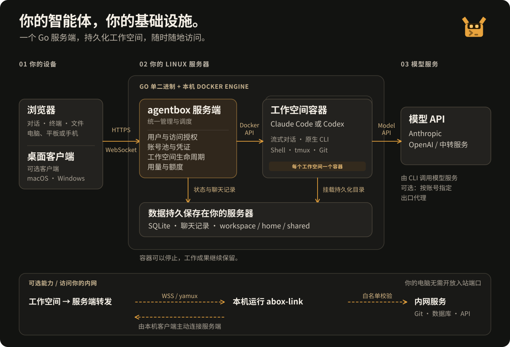

<div align="center">


# agentbox

**把 AI 编码工作台，放在自己的服务器上。**

在 Linux 服务器运行 Claude Code 与 Codex CLI，打开浏览器即可使用。<br /> 从一句任务到审查代码，对话、终端、文件与 Git 都在同一个工作空间。

[](https://github.com/devilcoolyue/agentbox/releases/latest) [](go.mod) [](images/agent/Dockerfile) [](LICENSE)

[English](README.md) | **简体中文**

[快速开始](#快速开始) · [操作演示](#操作演示) · [界面预览](#界面预览) · [整体架构](#整体架构) · [使用文档](#使用文档)

</div>

<a href="docs/images/chat-dark.png">
  <picture>
    <source media="(prefers-color-scheme: light)" srcset="docs/images/chat-light.png" />
    
  </picture>
</a>

<p align="center"><sub>一个工作空间，完成整项任务。点击任意截图可查看原始分辨率大图。</sub></p>

## 为什么使用 agentbox？

在服务器上配置一次编码环境，之后从笔记本、台式机或手机继续项目。本机只需浏览器；Agent 和项目工具在服务端的 Docker 容器里运行。

| 你要做的事 | agentbox 提供的工作方式 |
| --- | --- |
| **随时继续上次的工作** | 项目文件、home 配置和对话历史持久保存，关闭浏览器后仍在 |
| **使用熟悉的 Agent** | Claude Code 与 Codex CLI，支持网页流式对话和原版交互式终端 |
| **在一个地方完成交付** | 上传或克隆 → 对话 → 运行与预览 → 审查 diff → 提交、推送或下载 |
| **复用自己的环境** | 用户级共享目录、分层 home 模板、Claude 技能与支持空间覆盖的 MCP 配置 |
| **让可信团队统一使用** | 集中账号池、按用户授权、用量明细、历史价格快照与可选额度管理 |
| **连接自己的服务** | 可选 abox-link 隧道，访问白名单内的代码仓库、数据库与其他内网服务 |

你准备服务器，以及自己的 Claude / Codex 订阅、API Key 或兼容中转账号。Agentbox 提供工作空间和管理能力，模型调用遵循对应服务商的条款与计费。

## 操作演示

**对话 → 终端 → Git 审查 → 文件预览。** 动图先看核心工作台；34 秒 MP4 还展示技能、MCP、用量与内网连接。

[](docs/media/agentbox-tour.mp4)

<p align="center"><a href="docs/media/agentbox-tour.mp4"><strong>观看 / 下载更清晰的 MP4</strong></a> · <a href="#界面预览">查看高清界面截图</a></p>

<sub>截图按 2 倍像素密度采集；截图与演示来自实际浏览器界面，使用合成项目、对话、命令输出和用量记录，不代表模型实测效果。图中源码界面为中文，发布版本可能存在差异。</sub>

## 快速开始

### 在 Linux 服务器安装

```bash
curl -fsSL https://raw.githubusercontent.com/devilcoolyue/agentbox/main/install.sh | sudo bash
```

安装器会下载并校验服务端发布包、构建工作空间镜像，再启动 `agentbox.service`。**服务器无需安装 Go 或 Node.js。** 首次构建镜像需要几分钟，以及访问容器镜像源、Debian 软件源和 npm 的网络。

- **运行环境：** Linux x86_64 / arm64、systemd 与本机 Docker Engine。Ubuntu 22.04+ / Debian 12+ 会自动安装缺失依赖；其他发行版见[安装前提](deploy/README.md#一键安装)。
- **打开登录：** 访问 `http://服务器IP:8180`，使用安装完成时显示的 `boxadmin` 和随机密码。直接远程访问需放行 TCP 8180；公网长期使用请配置 [HTTPS](deploy/README.md#https-与-websocket-反向代理)。
- **服务端正式版：** [v0.1.9](https://github.com/devilcoolyue/agentbox/releases/tag/v0.1.9)。命令默认安装最新正式版；末尾加 `-s -- --version v0.1.9` 可固定版本，加 `-s -- --listen 127.0.0.1:8180` 可限制为仅本机监听。
- **已有部署：** 使用控制台更新入口或[升级指南](docs/releases.md#升级与回退)。安装器会保留已有部署，不覆盖安装。

配置位于 `/etc/agentbox`，数据位于 `/var/lib/agentbox`。每个空间默认限制 2 GiB 内存、2 CPU，请按并发空间数准备资源。完整选项与失败恢复见[安装说明](deploy/README.md#一键安装)。

### 完成第一个任务

1. **添加账号：** 在「系统设置 → 账号池」选择 Claude 或 Codex，接入订阅或 API / 中转账号。[账号配置 →](docs/accounts-and-models.md)
2. **创建空间：** 选择 Agent 和对应账号。
3. **带入项目：** 上传文件，或在「终端」中将仓库克隆到 `/workspace`。
4. **发送任务：** 在「对话」描述目标，随时切到文件页查看或终端执行命令；它们操作同一份项目文件。
5. **审查并交付：** 在「变更」查看 diff，再提交代码。可以直接下载产物，也可以配置 Git 连接后推送并创建 PR / MR。[操作指南 →](docs/user-guide.md)

<details>
<summary><strong>希望从源码构建？</strong></summary>

在准备好 Docker、Git 和 [go.mod](go.mod) 对应 Go 工具链的 Linux 服务器执行：

```bash
git clone https://github.com/devilcoolyue/agentbox.git
cd agentbox
go build -o agentbox ./cmd/agentbox
./scripts/build-image.sh
openssl rand -hex 24
```

将下面内容保存为 `config.json`，先把密码占位符换成刚生成的随机字符串：

```json
{
  "listen": "127.0.0.1:8180",
  "auth_token": "CHANGE_ME_TO_A_LONG_RANDOM_TOKEN",
  "data_dir": "data",
  "agent_image": "agentbox-agent:latest",
  "accounts": [],
  "proxies": []
}
```

```bash
sudo ./agentbox -config config.json
```

服务器本机打开 `http://127.0.0.1:8180`；远程使用可在自己的电脑运行 `ssh -N -L 8180:127.0.0.1:8180 user@your-server`，再打开同一地址。使用 `boxadmin` 和配置中的 `auth_token` 登录。首次启动后密码保存在数据库，修改 `auth_token` 不会重置它。

服务端需要 Docker 访问权，以及为挂载目录设置 `1000:1000` 属主的权限。结束前台试跑后，执行 `sudo ./deploy/install.sh` 和 `sudo ./deploy/deploy.sh`，以源码目录方式交给 systemd 托管。详见[部署手册](deploy/README.md)、[配置参考](docs/configuration.md)和[开发指南](docs/development.md)。

</details>

## 整体架构

**一个 Go 服务端，加上 SQLite 和 Docker。** 网页资源嵌入服务端二进制；每个工作空间有自己的容器，文件与历史保存在宿主机。

[](docs/images/architecture-cn.svg)

| 层次 | 负责什么 |
| --- | --- |
| **浏览器 / 可选桌面端** | 连接服务端，进入自己的工作空间 |
| **Agentbox 服务端** | 登录鉴权、账号授权、空间生命周期、HTTP / WebSocket、Git 操作、用量和额度 |
| **工作空间容器** | 运行 Claude Code / Codex CLI 和项目工具，连接配置的模型服务商 |
| **持久存储** | SQLite 状态与账本、项目文件、home 目录、共享文件与 JSONL 聊天历史 |
| **可选 abox-link** | 通过明确的白名单，连接本机可达的内网服务 |

对话与终端共享文件，**不会自动共享对话上下文**。一个空间可有多条对话线程，同一时刻运行一个网页对话回合。每位用户的 `/shared` 可供其所有空间使用。停止容器后文件与历史保留，但容器内进程会结束。

## 界面预览

### 需要直接控制时，切回熟悉的 CLI

打开 Shell、Claude Code 或 Codex CLI 终端，运行测试、安装依赖。只要容器仍在运行，网络断开后可重新连接原来的 tmux 会话。

[](docs/images/terminal.png)

### 交付之前，看清每一处改动

浏览文件列表和 diff，确认后提交当前仓库的改动。支持 HTTPS Token、SSH 及已配置的 GitHub / GitLab OAuth 连接，可在网页获取、拉取、预览推送并创建 PR / MR。

[](docs/images/changes.png)

### 用量和费用，有据可查

按时间、用户、Agent 和模型筛选，查看 token、入账费用、价格快照与响应延迟，支持导出 CSV。管理员可以维护价目表和用户余额。

[](docs/images/usage.png)

<details>
<summary><strong>文件管理与文档预览</strong></summary>

在项目和共享目录中浏览、编辑、上传与下载。源码视图提供语法着色、行号与全屏；可在源码与 Markdown / HTML 渲染预览之间切换，检查生成的文档和页面。

[](docs/images/files.png)

[](docs/images/preview.png)

</details>

<details>
<summary><strong>可复用的技能与 MCP 工具</strong></summary>

将 Claude 技能安装到当前空间或用户模板。MCP 支持用户默认配置、空间覆盖、JSON 导入和容器内连接检测；Codex 的技能与 MCP 通过 CLI 配置。

[](docs/images/skills.png)

[](docs/images/mcp.png)

</details>

<details>
<summary><strong>账号池与内网访问</strong></summary>

集中维护订阅、API Key 与中转账号，并指定使用范围。需要访问本地或公司内网时，通过 abox-link 配对，仅开放允许访问的目标。

[](docs/images/accounts.png)

[](docs/images/tunnel.png)

</details>

<details>
<summary><strong>浅色主题与手机访问</strong></summary>

支持浅色、深色和跟随系统；手机布局提供抽屉导航、触屏终端快捷键栏、滚动与长按粘贴。

[](docs/images/chat-light.png)


</details>

如何使用演示数据复现截图和视频，见[截图录制说明](docs/development.md#文档截图)。

## 选择适合你的入口

| 入口 | 适合做什么 | 获取方式 |
| --- | --- | --- |
| **网页控制台** | 对话、原版 CLI 终端、文件、Git、技能、MCP 与系统管理 | 服务端自带，本机无需安装 Agent |
| **桌面应用** | Windows/macOS 原生入口、项目终端、文件传输与可选同步 | [下载 0.1.2](https://github.com/devilcoolyue/agentbox/releases/tag/desktop-v0.1.2) · 未签名公开测试版 |
| **abox-link** | 让云端空间访问白名单内的内网服务 | 可选工具；Windows、macOS、Linux 本机面板或无头命令行 |
| **HTTP / WebSocket API** | 脚本管理空间、查询用量 | [API 文档](docs/api.md) |

桌面应用提供 Mac Apple Silicon、Mac Intel 和 Windows x64 安装包，连接已有服务端，不替代或升级服务端。v0.1.8 服务端提供基础模式；v0.1.9 增加项目终端、配对和同步后端。**同步默认关闭，需管理员显式启用。** 桌面 0.1.2 需手动下载安装，macOS 未公证、Windows 未签名，尚未启用自动更新。源码、配置和验收范围见[对应版本的桌面指南](https://github.com/devilcoolyue/agentbox/blob/v0.1.9/desktop/README.md)。

可选的[远程浏览器镜像](docs/remote-browser.md)还能在空间中提供完整浏览器桌面，保留网站登录状态，支持剪贴板和下载。网页登录与 CLI 授权独立，需要管理员选用带浏览器的镜像。

## 使用前了解这些边界

- **账号共享面向可信用户。** 凭证会交给容器内 CLI，有终端权限的用户可以读取。账号范围控制新操作准入；撤权不会回收已交付凭证或终止已有进程，见[账号授权](docs/accounts-and-models.md#账号使用范围)。
- **文件持久化不等于进程一直运行。** 长期文件请放在 `/workspace`、`/home/agent` 或 `/shared`。停止、重建和空闲休眠会终止容器进程；关闭浏览器不会立即停止容器。
- **额度不是实时消费硬上限。** 网页对话在回合结束时结算，最后获准的一轮可能超支；支持的终端用量仅记录、不扣余额，见[用量与额度](docs/usage-and-quotas.md)。
- **用户文件需要完整备份。** 默认系统备份包含配置、凭证、数据库、模板与 MCP 管理状态，不包含工作区文件与聊天历史；完整备份需停止服务和相关容器，见[备份与恢复](deploy/README.md#备份与恢复)。
- **由可信管理员维护服务器。** 当前使用本机 Docker，同一数据目录只能运行一个服务进程。Agent 默认以 `bypassPermissions` 执行代码，容器使用非 root 用户和资源限制。服务部署会短暂断开连接。
- **提交与推送是两步。** 网页提交不执行 hook 或签名，也不自动推送；需要这些提交行为时使用终端，见 [Git 管理](docs/architecture/git-management.md)。

## 使用文档

中英文 README 提供相同的功能概览和上手流程，详细指南目前为中文，也可从[文档目录](docs/README.md)按角色阅读。

| 你想做什么 | 阅读文档 |
| --- | --- |
| 使用对话、终端、文件、预览与 Git | [工作空间指南](docs/user-guide.md) |
| 接入账号、选择模型 | [账号与模型](docs/accounts-and-models.md) |
| 复用技能、模板与 MCP 工具 | [技能、插件与 MCP](docs/skills-and-mcp.md) |
| 查看或管理成本 | [用量与额度](docs/usage-and-quotas.md) · [价格目录](docs/pricing-catalog.md) |
| 访问内网服务 | [代理与 abox-link](docs/networking.md) |
| 安装、升级、备份与恢复 | [部署手册](deploy/README.md) · [版本发布](docs/releases.md) · [CLI 兼容性](docs/compatibility.md) |
| 配置服务端或接入脚本 | [配置参考](docs/configuration.md) · [API 文档](docs/api.md) |
| 排查错误 | [常见问题](docs/troubleshooting.md) |
| 参与开发 | [开发指南](docs/development.md) · [贡献说明](CONTRIBUTING.md) |

## 开发与贡献

服务端使用 **Go + SQLite + Docker**，网页控制台使用 **TypeScript、原生 ES Modules 和 xterm.js**。工具链与各平台校验方式见[开发指南](docs/development.md)。

```bash
go build ./...
go test ./...

# 修改前端时执行
npm ci
npm run check
npm run build
```

修改 `web/src/` 后，一并提交生成的 `internal/web/static/js/`。完整容器验证以 Linux 为准，macOS 构建和单元测试不能替代它。

欢迎提交具体问题、使用建议与聚焦改动的 PR。反馈附上复现步骤和脱敏日志；安全漏洞通过 [SECURITY.md](SECURITY.md) 私密报告。如果 agentbox 对你有用，点一个 **Star**，让更多开发者发现它。

## 许可证与社区

[Apache-2.0](LICENSE) · [版权声明](NOTICE) · [第三方许可](third_party/README.md) · [更新记录](CHANGELOG.md)

模型服务与运行时 CLI 遵循各自的上游条款。感谢 [LINUX DO](https://linux.do) 社区的支持与交流。
