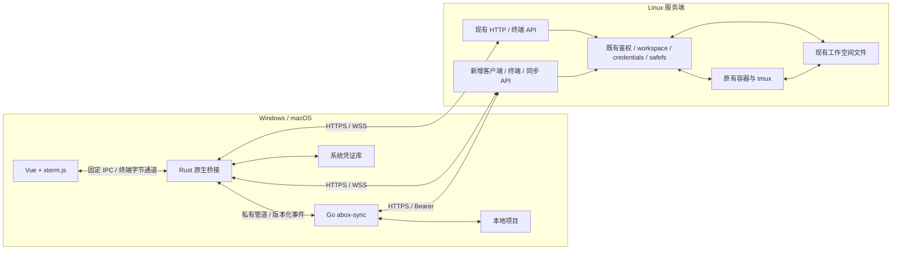

# 跨平台桌面客户端集成计划

状态（2026-10-04）：P0～P5 范围内功能开发已完成，交付定位为未签名测试版；正式签名、公证、最低系统与物理交互保留为发布门槛。同步默认关闭（`desktop_sync_enabled=false`，能力 `sync=0`），管理员可明确启用。当前验证证据和剩余边界见[开发验收表](desktop-client-acceptance.md)，历史过程见[实施记录](desktop-client-progress.md)。设计日期：2026-10-02。

目标：在同一个 agentbox 仓库内，提供 Windows 与 macOS 桌面客户端，吸收
`zzusec/agentbox-client` 的主要用户功能，保持现有服务端、网页与 abox-link 的行为兼容。

## 1. 核实结果与推荐决策

本次只做源码、配置和已有验证记录核对，没有重新执行参考项目的构建或平台验收。

| 项目 | 核实基线 | 实际实现 |
| --- | --- | --- |
| agentbox | 本地 `eb845db` | Go 服务端、TypeScript 网页、xterm.js、schema 9；已有 HTTP 登录、终端 WS、文件 API、abox-link |
| agentbox-client | `7f357a823548724c5c4c3af8e73e6462d6eb38a9`，客户端 v0.2.26 | Swift/SwiftTerm Mac 应用、Go abox-sync、项目与同步服务端；schema 12，还包含双账号实例、独占账号绑定和实例代理改造 |
| cursors_dashboard | 本地 `26db287c57954ae1f8df62513359c88dff154f22` | Tauri 2 + Vue 3/Vite/TypeScript，共享界面；Rust 壳 + 随包 Python 后台；macOS ARM64/x64、Windows x64 构建和安装验证链路 |

`cursors_dashboard` 的跨平台能力有明确实现依据：

- `desktop/src-tauri/tauri.conf.json`：app、DMG、NSIS 打包目标，本地随包界面和受限 CSP。
- `desktop/src-tauri/Cargo.toml`：Tauri 2、原生 keyring、更新器、单实例支持。
- `.github/workflows/release.yml`：macOS ARM、macOS Intel、Windows x64 原生 runner。
- `.github/workflows/p4-desktop.yml`：真实 NSIS 安装、应用重定位、首次/再次启动和异常退出清理。
- `docs/plans/p4-verification.md`：三平台通过记录，以及最低系统、纯净设备等未覆盖边界。
- `docs/plans/windows-startup-crash.md`：启动失败分类、重试、日志和父进程退出清理的修复经验。
- `docs/release-automation.md`：一次构建、原产物验证、更新签名和失败恢复流程。

推荐采用 **Tauri 2 + Vue 3/TypeScript + xterm.js + Go abox-sync**：

1. Windows/macOS 共用桌面界面、终端与业务逻辑；不并行维护 Swift 和另一套 Windows UI。
2. Rust 只承接系统凭证、受限原生调用、网络连接、文件选择、进程监管和更新。
3. Go 复用/改造同步引擎；不因参考项目使用 Python 而给 agentbox 增加 Python 桌面后台。
4. 当前网页继续使用原生 TypeScript/tsc。桌面单独使用 Vue/Vite，不迁移主控制台框架。
5. 同仓库、独立构建与发布。服务端构建不需要 Rust、Swift 或桌面前端依赖。

Swift 客户端作为行为与交互参考，Go 同步代码按模块移植并保留出处、许可和适用测试。
不整体合并 fork 的服务端模型改造。参考仓库不做修改。

## 2. “完全兼容”的可执行定义

本计划的目标是升级后的行为兼容和旧服务端的明确降级。下表保留原设计目标；当前实现已对冻结旧版本开展兼容回归，实际覆盖范围见开发验收表，不据此承诺所有历史版本。

| 组合 | 目标行为 |
| --- | --- |
| 新客户端 + 当前未升级服务端 | 地址/用户名/密码登录，列出原工作空间，连接原有终端，复用已验证的文件能力；项目终端与自动同步明确不可用 |
| 新客户端 + 增量扩展服务端 | 配对、独立项目终端、项目目录映射、可靠双向同步及完整桌面体验 |
| 现有网页/abox-link + 扩展服务端 | 原接口、终端默认会话、账号规则、代理、用量和生命周期保持原语义 |
| 较旧新客户端 + 后续服务端 | 按显式协议版本和能力协商工作；未知能力忽略，必需协议不支持时拒绝该功能 |
| 旧服务端二进制 + 已迁移的新数据库 | 不承诺；按现有版本保护拒绝，使用兼容备份恢复回退 |
| 对方原版 Swift 客户端 + 我方扩展服务端 | 首版不承诺直接兼容；新桌面客户端适配我方协议，旧 fork 数据不自动导入 |

完全不升级服务端，无法凭现有文件 API 提供租约、条件写入和完整同步语义。
旧服务端模式禁止以高频上传下载冒充安全的自动双向同步。

兼容不变项：

- 一个工作空间仍对应一个容器、一种 Agent 和绑定账号；账号可以按现有授权规则被多个空间复用。
- 保留 `sessions.agent/account_id/default_model`、账号级代理和凭证同步→刷新→立即播发顺序。
- 保留 `/workspace`、`/home/agent`、`/shared` 和宿主机数据布局，不迁移用户现有目录。
- 原 `GET /api/sessions/{id}/term` 无新参数时仍接原 `main` tmux，会话不被新客户端后台抢占。
- 原有聊天、Git、MCP、技能、额度与备份均保持入口和行为；新终端复用原准入、活动引用与撤权检查。
- 桌面终端用量继续作为 terminal 补记，不新增扣款语义，不把它转换成网页聊天流水。
- 普通文件获取继续保持现有属主边界；不把账号准入错误变成无凭证执行或代理直连。

## 3. 功能范围

| fork 功能 | 集成方案 | 阶段 |
| --- | --- | --- |
| 配对登录与记住连接 | 新客户端配对接口；旧服务端用已有登录；凭证按服务器+用户存原生凭证库 | P1/P2 |
| 工作空间/项目列表 | 保留空间；项目定义为其中的根目录或子目录映射 | P2 |
| AI 终端、普通 shell、多标签 | xterm.js 统一实现，新增独立终端资源；接入容器 tmux | P1/P2 |
| 断线恢复、休眠唤醒 | 心跳、退避、分类关闭码；恢复 tmux 连接 | P1/P2 |
| 字体、主题、缩放、搜索、鼠标模式、中文输入 | 两平台共用界面，平台快捷键和 WebView 行为单独适配 | P1/P4 |
| 文件拖放、Finder/Explorer 文件粘贴、截图粘贴 | 原生桥接读取，受限文件选择句柄，上传进度/取消与输入暂存 | P4 |
| 项目本地目录映射、改名、启动参数 | 稳定项目 ID；远程路径和本地映射分离；继承空间 Agent | P2/P4 |
| 双向同步、忽略规则、首次来源选择 | 改造 Go 同步引擎；文件级三方比较，冲突暂停 | P3 |
| 强制单向覆盖、回收站、日志、dry-run | 先计划与预览再执行；覆盖操作不在后台循环触发 | P3/P4 |
| 同步状态、进度、文件传输记录 | 版本化结构事件驱动 UI；每个任务独立状态与取消 | P3/P4 |
| 自动更新 | 独立桌面发布通道、签名清单、兼容检查、安装前收尾同步 | P5 |
| 双账号实例、账号独占、实例代理、网页重设计 | 不纳入本计划；与服务端兼容目标冲突或属于独立产品决策 | 后续另议 |

Claude 和 Codex 都支持，但由用户选择对应 Agent 的空间。首版不能在只有 Claude
授权的空间里选择 Codex。修改启动命令不新增第二账号、不开宿主机 shell，也不改变已有进程。

目录映射支持工作空间根 `.`，避免强迫已有根目录项目搬进子目录。子目录映射可以新增，
但同一设备对同一远程空间或本地目录的重叠可写映射必须拒绝，避免父子目录重复同步。
仅移除映射默认不删除文件；删除远端目录、删除本地副本须分别明确操作。

## 4. 建议架构与目录



建议新增结构（名称在 P0 协议评审后冻结）：

```text
desktop/
  package.json                   桌面独立依赖与构建入口
  src/                           Vue 界面、xterm、连接/项目/同步状态
  src-tauri/                     系统适配、受限网络桥接、凭证与进程监管
  scripts/                       打包、安装后 smoke、各平台验证
cmd/abox-sync/                   独立 CLI 与桌面受控运行模式
internal/syncclient/             同步计划、传输、基线与恢复
internal/syncfs/                 客户端跨平台文件系统适配
internal/server/client_*.go      增量 API，复用原生命周期和服务
internal/store/                  新客户端元数据及连续迁移
docs/desktop-client.md           实施后新增使用说明
```

不直接跨桌面与网页导入当前 `web/src/term.ts`：它依赖全局状态、DOM 和聊天模块。
先复用终端报文约定、行为用例和 xterm 经验，之后再提取不依赖 DOM 的协议/重连模块。

## 5. API、鉴权与持久化兼容设计

### 5.1 能力协商和旧服务端

新增经过登录鉴权的 `GET /api/clients/capabilities`，返回协议主版本、配对/项目终端/
同步功能版本、限制和最低兼容客户端要求。HTTP API 版本与本机 IPC 版本分别管理。
客户端首先通过现有登录或用户主动提供的配对完成身份建立，再查询能力。

旧服务端可能把未知 API 返回为 HTML 页面，所以同时检查 HTTP 状态、Content-Type 和
JSON schema；404/明确不支持进入基础模式，401要求重新登录，超时/5xx 显示连接异常，
不能把临时故障判断成“不支持”。配对码流程只在能力已知或兑换成功后启用；用户始终可以
使用旧登录入口，客户端只保存令牌，不保存密码。

基础模式支持手动打开原终端，但提醒它与网页共享 `main` 会话；不把多个标签伪装为独立 shell。
不自动往未知终端输入 `cd`/启动命令以模拟新接口。上传能力按服务端响应验证，不假定旧版
必定返回可插入终端的路径；不满足时只显示上传结果。

### 5.2 新接口作为增量扩展

候选路由：

- `POST /api/clients/pair`、`POST /api/clients/pair/redeem`：复用配对原语，与隧道开关解耦。
- `/api/sessions/{id}/client-projects`：项目 ID、相对目录、展示名和启动设置。
- `/api/sessions/{id}/client-terminals`：创建/列举终端资源。
- `/api/sessions/{id}/client-terminals/{terminal}/stream`：终端 WS，保持二进制输入输出、JSON resize 约定。
- `/api/sessions/{id}/client-terminals/{terminal}`：显式结束该终端。
- `/api/sessions/{id}/sync/targets/{target}/…`：manifest、lease、plan/apply 或受条件约束的 file 操作。

新会话资源统一 `auth + withSession`，子资源再次确认属于该空间；写接口只接受 Authorization。
项目列表/文件查看不自动启动容器。启动命令只在用户有终端执行权限的容器内生效。
tmux 名称用稳定项目/终端 ID 派生，项目展示名改变不会产生孤儿进程；改实际目录时先处理
活跃终端与同步占用。删除空间取消相关请求、同步租约和连接，避免 purge 后又创建目录。

桌面通过 Rust 原生 HTTP/WS 使用 Authorization 头，避免把长期令牌放进 URL 或渲染器存储。
现有 `sameHostOrigin` 不放宽为任意来源；原生连接使用原生客户端语义，鉴权仍必需。
前端只加载随包界面，不能让远程页面拥有本地 IPC 权限。外部链接由系统浏览器打开。

凭证键由规范化服务器地址、用户身份共同组成，区分多个服务器上的同名用户。
macOS 用 Keychain，Windows 用 Credential Manager；读取失败要求修复或重新登录，不回退明文。
退出登录撤销该登录令牌，停止使用该身份的网络和同步任务；不误删其他连接凭证。

### 5.3 数据迁移和回退

只增加客户端项目/终端元数据及租约需要的表或列，不改旧 sessions 的账号/Agent/代理语义。
具体迁移编号按实施时主仓库最新 schema 接续，不照搬 fork 的 10/11/12。
若增加配置，必须进入 Config.mutate/persist；协议能力不应依赖客户端猜配置。

首次连接不扫描后自动移动或改名用户项目；根目录可注册为逻辑映射。迁移需覆盖完整旧库、
空库、事务中断、重复启动、恢复备份和高版本拒绝。默认系统备份包含新增数据库元数据；
完整备份涵盖用户文件。客户端本地基线独立保存，恢复后基于服务器身份/空间 ID/映射重建。

即使只添加表，也会提高 user_version，因此旧二进制不能直接回退读取。发布前保存并验证
兼容备份；若已发生新文件修改，回退前单独保全它们，不能把数据库恢复误当作文件恢复。

## 6. Windows/macOS 共用开发的具体要求

### 6.1 平台范围

- 首批正式构建目标：Windows x64、macOS ARM64、macOS Intel x64，三者同一验收门槛。
- Windows 10 22H2/Windows 11、macOS 12+ 作为待验证候选范围；P0 核实依赖下限，P5 在最低
  版本实机/虚拟机通过后才写入正式支持表，不能照搬参考仓库的 minimumSystemVersion 声明。
- Windows ARM64 与 Linux 桌面预留适配结构，首批不标为已支持。
- 用户只安装客户端，不要求本地 Go、Node、Rust、Python、Docker、WSL 或 SSH。
  Windows WebView2 的检测、安装引导和离线部署方式列入安装验收。

### 6.2 终端、剪贴板和原生能力

- 本地只渲染远端 Linux PTY，不引入本地 ConPTY/PowerShell 来启动 Agent。
- macOS 使用 WKWebView、Windows 使用 WebView2；原生壳上验收 CJK 输入、候选窗、emoji/
  宽字符、中文字体回退、选区、滚动、高 DPI、缩放、标签切换和 GPU 渲染降级。
- Windows `Ctrl+C` 保留中断语义；复制粘贴提供 `Ctrl+Shift+C/V`，Mac 使用 `Cmd+C/V`，
  右键菜单保持可发现。逐个平台验证组合键与 TUI 冲突。
- Finder/Explorer 文件列表粘贴、图像剪贴板和拖入文件用窄原生适配，不能只验证浏览器文本 paste。
- 本地文件选择使用受限句柄/授权映射，网页不能传任意绝对路径让后台读取；大文件流式上传，
  终端输出走有界批量字节通道，背压与取消避免 UI 阻塞或缓冲无限增长。

### 6.3 文件系统差异

| 差异 | 设计要求 |
| --- | --- |
| 大小写不敏感、Unicode 规范化 | 建立映射前检测实际卷能力和路径碰撞；如 `A.ts`/`a.ts` 无法共存则暂停，不静默覆盖 |
| Windows 保留名/非法字符/尾点空格/ADS | 对 CON、NUL、冒号等路径做完整预检；保持名称，报告不兼容，不自动重命名后回传 |
| 盘符、UNC、不同卷、长路径 | 网络/可移动卷首版默认不进入自动同步；本地目录与远程 POSIX 相对路径分别表示；跨卷回收站需复制校验后再移除或安全失败 |
| 权限位不同 | Windows 不以 chmod/mtime 模拟完整 POSIX 权限；保存远端可执行位等元数据，新文件采用服务端明确默认值，避免来回覆盖/永久不同步 |
| 文件占用、杀毒软件扫描 | 原子替换失败有界重试并保留旧文件/临时文件状态；不得先删除目标再重试 |
| 符号链接、junction、reparse point、硬链接 | 默认不自动跟随；在实际文件访问时限定根目录并检查链接替换，不能仅启动前字符串检查 |
| CRLF/LF、BOM、二进制 | 按字节传输和校验，不自动转换；IDE 自动换行变化视为真实文件变化 |
| 缺目录、磁盘离线、无权限、磁盘满 | 视为错误，不能当成空清单并向另一端传播删除；重新绑定必须重新确认 |

当前服务端 `internal/safefs/root.go` 直接依赖 `golang.org/x/sys/unix`，不应直接成为 Windows
同步程序的依赖。客户端文件访问抽出跨平台边界，平台差异用构建标签与实机测试覆盖；保持
服务端已有 safefs 约束。Windows CI 只构建/测试桌面和同步的可移植依赖图，不要求 Linux
服务端全部包在 Windows 上 `go test ./...`。

### 6.4 Go 后台监管

参考 cursors_dashboard 的就绪握手、错误分类、退出清理和安装目录重定位经验；不照搬 Python
运行时。桌面模式用私有 stdin/stdout 版本化协议，日志走 stderr；令牌通过管道传入，不落
配置、不放命令行。命令行独立模式另外定义凭证输入方式。

Rust 负责单实例和进程句柄；Go 收到父管道 EOF 取消网络、收尾原子写入并退出。Windows 处理
无控制台子进程与 Job Object，Mac 处理受控子进程退出；用实际安装包强杀测试验证没有孤儿
同步进程。启动失败展示可重试状态与脱敏日志，避免“壳打开但后台已死”。默认关闭应用停止
同步；托盘驻留可后续作为明确开关，不首版安装后台系统服务。

## 7. 同步协议须补强的部分

fork 的文件级三方计划、进度事件、回收站与 dry-run 可作为基础，但不能直接按 Mac 行为
宣称跨平台可靠。首版必须补齐以下约束：

1. 本地基线绑定服务器身份、用户、空间、项目、目录和协议版本；单目录互斥，映射不重叠。
2. 首次两边都有不同内容时展示预览，选择来源后建立基线；已有基线时，两边改同一文件且
   内容不同则暂停该项目。首版无自动文本合并；用户可保留两份、手动合并再重新扫描。
3. 写租约有到期、续租、设备身份和代次校验；过期客户端的写入被拒绝，服务重启后重新获取。
   无租约设备可查看清单，首版不自动更新其本地副本，避免把“只读跟随”误变成覆盖本地修改。
4. 上传/删除带预期文件版本或哈希，服务端在受控写操作锁内重新验证；下载校验大小和哈希。
   同步期间本地也可能编辑，替换前复核本地基线条件；发现变化停止该项，保留两份内容。
5. 租约仅协调同步客户端，无法锁住 CLI、网页编辑器或本地 IDE。写前复核和写后扫描不能
   对任意外部进程提供严格事务隔离；需保存覆盖前版本、记录冲突并提供恢复，不宣称绝无丢改。
   高频编辑同一文件时推荐暂停同步或错开编辑，不能以“租约已持有”掩盖并发窗口。
6. 上传、删除和基线提交设计幂等操作 ID；部分完成、取消、重启后重新核对，不能把整批标为成功。
7. 本地和远端删除/覆盖前的恢复副本置于各自同步忽略范围；配额、磁盘占用、保留与清理策略明确。
   大批量删除默认停止；强制覆盖也必须预览并确认本次计划，扫描失败绝不能跳过保护。
8. 权限位、文件元数据与内容相等分别判断；可缓存 stat/清单，但强制复核可检测同大小/mtime 的变化。
9. 初始方案采用自适应轮询：活跃约 1 秒、空闲退避，失败指数退避；扫描并发、文件大小、条目数、
   响应体、重试均有限制。先验证大型树性能，再决定是否增加 fsnotify，事件不能成为唯一事实来源。
10. 默认忽略 `.git`、依赖、构建产物和同步状态目录；支持 `.agentboxignore`，但不假定所有
    `.gitignore` 等价。忽略规则改变先预览，不能把“新忽略”视为删除并清空另一端。

## 8. 开发阶段与验收门槛

| 阶段 | 交付 | 通过条件 |
| --- | --- | --- |
| P0：兼容契约与跨平台原型 | 固定基线、协议草案、Tauri+xterm 最小壳、Go 后台管道、Windows/macOS CI | 两平台真实壳连接模拟终端，输入/resize/高输出背压/重连通过；验证文件名碰撞、替换和退出；确定最低系统候选 |
| P1：旧服务端可用客户端 | 旧登录、空间列表、原终端、凭证库、能力探测、基本主题字体 | 连接当前未修改 agentbox；未知 API 返回 HTML、401、超时均有正确行为；旧终端接管说明清楚；两平台产出开发安装包 |
| P2：增量项目终端 | 配对、逻辑项目、独立 AI/shell 终端、稳定 ID、生命周期接入、增量迁移 | 原网页/abox-link 合同回归通过；旧数据无目录搬迁；两个项目并行、断线、撤权、欠费、停止/purge、服务重启均验证 |
| P3：跨平台同步 | manifest/租约/条件写入、Go 引擎、Windows 文件适配、恢复副本与冲突呈现 | Windows↔Linux、macOS↔Linux 真文件测试；并发修改、断网/崩溃、续租过期、删除、磁盘错误、重复请求通过；失败不能宣称一致 |
| P4：主要体验补齐 | 拖放/文件与截图粘贴、取消、终端输入暂存、项目修改、同步日志与强制预览 | Windows Explorer 与 macOS Finder 实测；中文输入、高 DPI、系统休眠、两平台快捷键；状态按项目/任务归属正确 |
| P5：交付与兼容验收 | 三架构安装包、独立更新通道、许可清单、备份与迁移说明 | 真实安装后冷/热启动、移除开发工具、异常退出、更新中断、凭证延续、旧客户端/旧服务器兼容矩阵及最低系统测试 |

P0 验证 Tauri 的终端表现和原生桥接开销后冻结技术方案；如有阻塞先列出可复现结果再调整。
Windows 从 P0 就作为主目标，每阶段同时验收，不能用最后阶段的交叉编译代替 Windows 开发。
P2/P3 先在独立开发服务端验证，再产出兼容发布；本计划本身不授权生产部署。

实施时每阶段拆成可独立审查的 PR，记录改动、测试证据与剩余边界。耗时在 P0 原型和同步
故障测试后估算，避免把 Swift 界面移植与文件同步正确性当作机械复制。

## 9. 测试与发布矩阵

- Linux 服务端：现有 `go build/test/vet`、前端 check/build 产物检查；增加旧 API 合同、
  账号复用/授权、代理失败、模型/用量、迁移、备份、链接竞态、空间删除并发回归。
- Linux Docker：用隔离卷、模拟 CLI/合成 transcript 验证 PTY、tmux、重连和用量归属，
  无真实付费模型请求。Docker 实测与普通单测分开报告。
- Windows/macOS：同步库平台单测 + 编译后的 Go 后台 + 真 Tauri 壳 + 实际安装包；
  浏览器 Playwright 测试只能作为补充，不能替代 WKWebView/WebView2 终端验收。
- 端到端：Windows/macOS runner 连接临时 Linux 服务端（CI 服务环境或专用测试机），
  验证真实 WS/文件流。任何远程测试只使用合成目录/账号，不能接生产用户空间。
- 故障：传输中编辑、只改大小写、Unicode 碰撞、链接交换、Windows 文件锁、空间不足、
  外置目录失联、批量删除、断网后恢复、休眠、关闭壳、停止服务、取消与重复操作。
- 兼容：冻结当前 `eb845db` 服务端与网页作为基线；测试新桌面→旧服务端、旧网页/abox-link→
  新服务端、新桌面→新服务端、前一桌面协议→新服务端，断言实际响应与副作用。

发布采用 `desktop-vX.Y.Z` 或等价独立渠道，服务端现有发布入口只识别自身包与标签。
已核实 `install.sh` 和 `internal/server/updates.go` 都直接查询 GitHub `releases/latest`。
桌面 Release 必须显式禁止成为仓库 latest（发布 API 的 `make_latest=false`），并实测旧
安装器/更新器仍得到服务端发布；桌面通过专用签名更新清单选版。只增加标签前缀不足以兼容。
发布前继续审计其他脚本和镜像地址中的 latest 查询，不能要求旧用户先升级才避免渠道串包。
所有安装和更新来源只指向我方渠道，不继承 fork 的更新仓库或另一项目的签名身份。

借鉴参考项目的一次构建、验证同一产物、失败 job 恢复方式，但服务端与桌面独立发布。
应用内更新签名与系统签名分开记录：Tauri 更新包签名不代表 Windows Authenticode 或
Apple Developer ID/公证。开发包可标记未签名；正式支持声明以真实签名、安装和最低系统
验收证据为准，不复制参考项目尚未验证的承诺。

## 10. 完成标准与本次产出

“大多数功能已集成”的标准：用户在 Windows 或 Mac 安装客户端后，可连接已有空间、
打开独立 AI/shell 终端、映射本地目录、双向同步、处理文件冲突、拖放/粘贴附件、断线恢复，
并在更新后保留身份和配置；仅用浏览器的用户无需修改现有工作方式。

计划编写时只完成源码核实；用户随后授权实施。当前代码与验收状态以实施记录为准，
按 P0→P1→P2→P3→P4→P5 推进；新增原型不代表整个集成计划已经完成。
