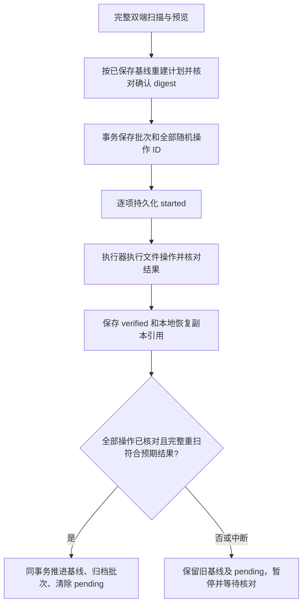

# 桌面文件同步：实现边界与预检

状态：P3 基础模块、本地预检、远端清单、租约、条件下载/上传/删除、远端目录操作、恢复日志、
服务端安装身份、本地绑定/基线/批次持久化和原生整项目执行器已写入；桌面 IPC 与绑定/预览/确认/取消界面已有初版，
待定批次核对和副本导出已接入；Mac ARM64 已通过真实 WebView/Rust/Go 的合成端到端验收，
Windows/Intel 实跑及跨 Linux 服务器验收待补齐；有界阶段/操作/字节进度、历史分页、容量查看、逐项冲突、
默认关闭的持续同步和未知批次归档已接入。本地副本与服务器原内容均支持显式清理，远端操作永久收据保留。
服务端 capabilities 的 `sync` 仍为 0；`sync_recovery_gc=1` 只宣告回收协议，不能凭它、本文件或基础库
测试开启同步，也不能将 P3～P5 标记为全部验收完成。

## 已实现的数据与比较规则

`internal/syncproto` 定义协议 v1、清单、SHA-256 和基线身份。文件按字节比较，保留 CRLF/LF、
BOM 和二进制。清单包括目录及普通文件，不能含缺失父目录、文件/子路径冲突或无效哈希；
扫描失败不返回部分清单。基线身份包含规范化服务器、服务器 ID、用户、空间、项目、远端
目录及本地目录身份，不能只依赖用户可重用的路径字符串。

`internal/syncclient.BuildPlan` 比较基线、本地和远端：

| 状态 | 计划 |
| --- | --- |
| 只有本地变化 | 上传或远端删除 |
| 只有远端变化 | 下载或本地删除 |
| 两边变化后内容相同 | 无传输，后续执行器可推进基线 |
| 两边变化且不同，包括删除与修改冲突 | 整个项目暂停，不能靠确认跳过冲突 |
| 首次两边有不同内容 | 要求选择来源，再生成覆盖预览 |
| 强制本地/远端优先 | 仅生成计划，须确认本次 digest；不在自动循环中执行 |
| 忽略规则或基线身份改变 | 拒绝沿用旧基线，不能转换成删除 |
| 一批删除 ≥20 文件，或 ≥5 文件且占目标侧 ≥25% | 要求确认具体预览 |

每项操作包含目标修改前的期望文件和修改后的文件，`null` 期望表示必须不存在。文件/目录
类型互换首版视为结构冲突，不能自动递归清除。删目录中若有要保留的远端或本地新文件，
在任何写入前报告冲突。目录创建按父先子后，目录删除按子先父后排序。Windows 本地上传
保留已存在远端文件的 executable 位；本地没有 POSIX 位不意味着远端应清空权限。

预览 digest 覆盖身份、两份清单摘要、操作和冲突。`Ready` 校验摘要及确认值；执行器会在
获取租约后重新扫描并重建预览，不能直接信任从界面传入的任意 Plan。

## 本地访问与写入

`internal/syncfs` 独立于服务端 Unix-only safefs。目录逐级固定 `os.Root` 句柄，拒绝链接；
普通文件用 Unix O_NOFOLLOW/O_NONBLOCK 或 Windows NtCreateFile 相对句柄且不跟随 reparse。
硬链接（链接数非 1）、特殊文件、junction/链接默认报错，不以目标文件替代。

扫描前后重新验证根目录身份；离线、目录被移动/替换、缺失或权限失败是错误，绝非空树。
文件每次哈希，stat/hash/stat 及同 inode 复核可检测普通并发变化与同大小/mtime 修改，
但不是文件系统快照，不声称对任意外部写入实现事务隔离。

能力探测在选中目录内创建随机 `.agentbox-sync-tmp-*` 目录，实测大小写与 Unicode 规范化
行为，只清理自身创建文件。本地身份由平台+卷/设备+inode/file-index 生成。Windows 拒绝
UNC/非固定盘；Mac 通过系统卷元数据及固定句柄核验内置不可移除磁盘，拒绝外置、网络、
磁盘映像、未知卷以及项目内另一卷的嵌套挂载，详见[卷策略](desktop-volume-policy.md)。
Linux 保持原已知网络卷检查，Linux 可移动设备识别仍未完整实现；首批桌面目标不包含 Linux。

目标名称检查涵盖 Windows 保留名（含 COM/LPT 上标数字）、非法字符、ADS、尾点/空格、
UTF-16 长度、大小写及 Unicode 碰撞；使用保守 Unicode case-fold，可能多报不兼容，绝不
自动改名后写回远端。Mac/Linux 的实际卷能力与 Windows 保守兼容报告分开显示。

`Writer.Replace/Delete/Mkdir/Rmdir` 已接入整项目执行器：

- 写入随机排他临时文件，限制长度、验证下载 SHA-256、flush 后再发布；缺目标用 Link
  不覆盖发布，已有目标用同目录原子 rename。Windows 占用失败原样返回，不先删除旧目标。
- 覆盖/删除前复制原内容到项目根目录下 `.agentbox-sync/recovery/<随机>.bak`，复制也验证
  期望大小与哈希。返回恢复文件相对项目根的路径；恢复管理 UI 支持导出与逐项确认清理，不自动删除。
- 每个项目根恢复区限制 1000 个文件、256 MiB；超限停止修改，没有自动清理。旧版各父目录
  的恢复文件不迁移/删除，仍作为目录内容阻止 rmdir；配额不能当成磁盘总容量保护。
- 传输后、保存副本后、最终替换前复核目标；条件不符不覆盖。错误发生在最终 rename 之后
  需重新扫描确认，不能将异常简单等同于“什么都没改”或直接重放。
- Unix fsync 目录；Windows 文件内容 flush，但目录重命名的断电持久性依赖文件系统。
- 锁只串行同 Writer 实例，不能锁外部 IDE/CLI；最后复核与 rename/remove 之间仍有竞态。
  租约、操作日志与恢复方案保留此限制；执行器不会将这些原语当作外部编辑器事务锁。

## 忽略规则与资源上限

默认忽略任何层级的 `.git`、node_modules、.venv、venv、__pycache__、dist、build、target、
`.agentbox-sync` 与受控临时文件前缀。不会实时同步 Git 元数据。

`.agentboxignore` 是受限 glob 格式，非完整 gitignore：空行/# 注释忽略；单段模式匹配任意
层级同名项，含斜杠模式相对根匹配，独立 `**` 跨目录。首尾斜杠被去掉，目录匹配后整个子树
排除；不支持 `!` 反选、转义或 `**suffix`，不支持的模式明确报错。规则本身规范化后哈希；
规则变化必须重新预览。忽略目录中的内容不扫描、不纳入已检查文件数量。

默认上限：10 万个枚举项（含忽略项本身，不遍历被忽略目录内部）、目录深度 128、每文件 64 MiB、每次扫描内容总量 2 GiB；规则
最多 64 KiB / 256 条。哈希过程中响应取消。扫描期间目录变化会失败，不伪造一致快照。

## 桌面入口与后台协议

已登录后侧栏“检查本地目录”调用固定原生命令，系统文件夹选择器给出路径；渲染器不能
传任意路径让后台读取。结果仅有文件/目录数量、字节、卷能力和 Windows 名称问题数量，
不上传数据。检查完成不建立同步绑定或保存基线。取消会通过父管道 EOF 请求后台退出，
3 秒未结束时强制收尾；原生系统文件选择框还需由用户关闭。

IPC 握手包含 `local_inspect_v1` 和 `sync_batch_v1`，`inspect` 命令通过私有管道携带 directory，返回 `inspected`
及 summary。单后台最多一个检查；仍可响应 ping/shutdown，EOF 取消并等待检查收尾。
错误只返回固定分类，不把原始 OS 错误/令牌写进日志。命令与响应各限 4 MiB（含换行），
超过的预览返回 sync_limit，不输出截断 JSON。

`sync_bind/list/preview/apply` 只通过私有管道调用；Rust 从当前原生登录提供 Bearer 和用户，
状态目录来自 app_data_dir，本地目录只能由系统 picker 选择，renderer 不得提供这些字段。
Go 每次核对认证身份和 sync capability；bind 还核对远端清单里的项目目录。绑定只返回摘要，
不返回完整基线或操作日志。原生层同一时刻只运行一个同步请求，退出登录先取消并等待侧车
退出，再撤销登录；取消/EOF 传播给 Go 网络请求，失败批次保持 pending。UI 只在 sync=1
时显示，包含持久化绑定选择、变更/冲突列表、方向选择、精确预览确认、取消与有界逐项/字节
进度。新增 sync_review/resolve/history/export、sync_recovery_discard 和
sync_remote_cleanup_review/cleanup；客户端进程重启可恢复绑定列表，不会自动执行旧批次或清理。

## 验证与剩余工作

Go 单元/race 覆盖三方冲突、旧预览拒绝、忽略变化、批量删除、路径/链接/硬链接、目录更换、
同大小/mtime 改动、写入失败/并发编辑和恢复副本。Linux ARM64 容器运行真实文件测试通过。
Windows/macOS Intel 测试程序及 Go 后台交叉编译通过；Windows 原生文件锁测试已纳入代码，
尚未实跑。Rust 测试使用编译后的 Go 后台检查合成目录并验证 EOF 收尾。

服务端只读清单复用 safefs，空间锁内扫描，不改客户端 Root 的严格路径检查来迁就宿主路径。
全局最多两项扫描，每次 60 秒超时，校验根目录身份、忽略规则、单文件与总量限制，错误无部分清单。
响应的 Windows 名称问题仅是兼容报告，不拒绝合法 Linux 名称或静默重命名。

租约注册表是进程内状态，无额外 DB 迁移；工作空间内重叠目录不可同时获租，30 秒过期、需显式
续租。随机令牌与随机代次同时验证，防止过期/重启后的旧请求冒充新写者。操作在空间锁内完成，
持有租约时项目设置/删除返回冲突。条件写入在空间锁内及发布前复核租约，不提供对外部 IDE/CLI 的隔离。

条件下载接口 `/sync/file` 要求项目 revision、规则 hash、路径和预期 hash/size/executable。
读取期间核对普通文件身份/属性/链接数和忽略规则，完整校验后才发送不可变快照；不重新按路径
打开文件来发响应。两个读取槽与清单共享，各文件上限 64 MiB、内容缓冲总量最多 128 MiB，
不在工作区创建下载临时文件；发送前释放空间锁，设置 60 秒写截止时间。规则文件本身也拒绝
符号链接/硬链接并限制 64 KiB。文件内容在响应期间被 CLI 改写，不会改变已验证的快照。

`syncclient.Remote` 已提供跨平台 Go 原生 HTTP 清单、租约和文件读取原语。地址支持部署前缀，
拒绝 URL 凭证/查询参数、默认拒绝远程明文 HTTP、保留 TLS 验证、禁止重定向，Bearer/lease
只放请求头。清单 JSON 限 64 MiB，校验结构、摘要与项目修订；失败不返回可用空清单。文件
流要求二进制类型、长度和 ETag，并在 EOF 再验证 SHA-256；未读到成功 EOF 的内容不能发布。
网络错误不回显 URL/响应正文；没有应用层自动重试或后台任务循环。IPC 已接入，能力仍关闭。

回环 HTTP 测试覆盖整项目执行器：先验证租约、两端预览与目标名称能力，消费完整下载到
暂存，复核本地条件，全部确认后提交基线。本地发布前再次检查租约和忽略规则，规则在传输
期间变化会停止写入；后台每 10 秒续租，按请求开始时刻计算 28 秒本地截止，失败取消工作。
这尚不等于跨平台真实桌面安装验收或对外部 IDE/CLI 的原子隔离。

## 条件写入、目录与恢复日志

`POST /sync/apply` 接收原始文件体，`X-Agentbox-Sync-Request` 为 base64url（无 padding）的
JSON 元数据：协议、32 位小写 hex 操作 ID、项目/修订、规则 hash、设备、租约 generation、
路径、kind、before/after。令牌仍只走 Authorization，租约令牌走独立请求头。kind 支持
replace（含新文件）、delete、mkdir、rmdir；文件/目录互换不支持。目录请求无文件体。

接收前检查权限与租约；最多两项传输共用清单/下载槽，读取截止 60 秒。上传接收期间不持有
空间锁，长度/哈希错误不会修改目标。完整接收后进入空间生命周期锁，重新校验项目修订、
规则、项目/父目录身份、租约和目标预期。新文件/目录用不覆盖 rename 发布；覆盖文件先保留
旧字节，再同父目录 rename；删除文件不递归，rmdir 只接受空目录并用 AT_REMOVEDIR，
即使目录被并发替换成普通文件，也不能退化为 unlink。非空目录（包括忽略项）保留并报冲突。
Linux 新文件/目录归属必须为 1000:1000；Mac 非 root 开发测试允许 chown 失败。

服务端日志位于 `sessions/<id>/client-sync/<operationID>/`，在 workspace/home 挂载之外；
目录 0700、文件 0600，不保存登录或租约令牌。`record.json` 先记录 uncertain 并 fsync，旧文件
保存为 before 并校验/flush 后才允许最终修改。发布与父目录 fsync/结果复核后记录 applied。
已有 applied ID 是收据：重复请求不再写入，也不保证路径现在仍是当时的内容；执行器必须重扫。
相同 ID 的不同意图拒绝；重新获租的 generation 不改变意图摘要，设备/项目/修订/路径/前后状态
则都计入摘要。进程重启使旧租约失效，但磁盘上的收据保留。

任何已记录但未明确 applied 的操作返回 409 uncertain，保留恢复信息，不自动推断成功或重放。
网络中断也可能发生在发布之后；客户端必须保留原操作 ID，查询 `/sync/operations/{id}`，
重新扫描后决定后续动作。`…/{id}/before` 提供已校验的旧字节下载，按空间属主鉴权，不要求
仍持有租约或项目映射。执行器在本地恢复副本完成后、用户文件变更前将其引用持久化；恢复接口只下载，不自动
覆盖当前文件；恢复 UI 提供原内容导出，不自动替换工作文件。
这是持久化意图与结果日志，不是文件系统事务，对 IDE/CLI 的最后检查与 rename/unlink 之间
仍有竞态；高频同时编辑不能宣称绝无丢改。断电恢复与磁盘满注入仍需完整端到端验收。

每个工作空间最多 1000 个活动操作、256 MiB 旧内容；到限停止新操作，不自动清理。显式回收只释放
活动名额和旧内容，原操作 ID 收据永久保留；每空间最多 100000 份永久收据（含 retiring 预占），
到限拒绝新的回收。永久收据元数据不被回收，因此该机制不能承诺无限历史。一次写操作最多持有
64 MiB 上传及 64 MiB 旧内容缓冲，两传输槽的内容缓冲总上限为
256 MiB（不含清单/HTTP/运行时开销）。此配额没有替代用户总磁盘配额，也不是最终保留策略。
完整备份包含这些日志与 before，默认系统备份不包含；purge 会一起移除它们。

Go Remote 和 `syncclient.Engine` 已支持 Apply、操作状态、恢复下载、租约续期和整批执行。
执行器无后台循环：每次应用都要求已确认的精确预览、server_id/user 绑定、完整重扫、租约和
最终清单核对；中断或 uncertain 保留 pending，禁止重放。恢复下载仍要求长度、ETag 和 EOF
哈希验证。`sync=0` 仍保持，正常服务端不会显示同步 UI。

尚未实现：批量恢复应用、真实 Windows↔Linux/Mac↔Linux 整项目传输故障测试、磁盘满/断电端到端验收。
P3 仍不能标记为面向用户完成。

## 服务身份与本地持久化

`internal/clientidentity` 把随机 server_id 保存到 `data/client-instance-id`，以 0600 文件、
fsync 和不覆盖发布保证并发创建只有一个身份。正常进程重启保留；损坏、链接或硬链接拒绝
而非重新生成。能力接口同时返回认证用户名；同步 API 校验可选 `X-Agentbox-Server-ID`。
新 Go Remote 通过 `ForBinding` 固定规范化 URL/server_id/user，后续每次请求发送并校验身份。
现有未固定身份的原语仅供开发测试，Engine 固定身份且再次检查 sync capability。

身份文件有意不在备份 allowlist 中：系统/完整备份恢复后生成新 ID，不能默默沿用旧客户端
基线。schema 仍为 10。直接复制整个 data_dir 会保留身份，独立克隆应走备份恢复；身份 ID
不是认证秘密或证书，不能替代 TLS/Bearer。

`syncclient.StateStore` 使用独立的本地 SQLite（schema 5、DELETE journal、synchronous=FULL）。
原生层提供可信的专用应用目录，在 Unix 要求目录私有权限；Windows 依赖每用户应用目录的
ACL。路径不得来自 renderer/服务器，也不得处于映射目录之内或包含映射目录。SQLite 自己
管理数据库/日志句柄，这不是针对同一 OS 用户恶意替换私有应用目录的沙箱。无新增依赖版本。

保存内容为设备 ID、绑定、本地目录实际 ID 与祖先 ID、修订号、基线、未完成批次和已完成批次
历史。无登录/租约令牌，也不保存文件内容。绑定比较实例/用户/空间/项目/远端路径、本地目录
身份和规范化 URL；同一本地树、父子树或同实例下重叠远端目录禁止同时注册，使用祖先文件 ID
防止路径别名绕过。状态按实例和认证用户发现，错误不能变成空映射/空基线。

持久化 API 本身不发网络请求、不改映射文件：Begin 使用已保存基线重建计划，旧确认/旧修订
拒绝；StartOperation 只允许按计划顺序从 prepared 到 started；VerifyOperation 保存核对
结果；Commit 要求全部 verified，并严格匹配按计划推导的两端最终清单。Windows 本地不虚构
可执行位，远端可执行位独立保留。Commit 事务同时归档批次、更新基线并清除 pending。
started 在崩溃后含义不确定，禁止重新 Start；没有自动清除、自动重放或恢复旧内容。

限制为最多 1024 个绑定、每绑定 1000 份完成批次历史、全库 256 MiB 逻辑 JSON 元数据；达到
上限停止新变更，无自动淘汰。SQLite 可保留空闲页且回滚日志需要额外空间，因此该限制不是
物理磁盘配额。磁盘错误不推进基线；断电耐久性依赖平台 SQLite/文件系统，尚未验收。
执行器已接入重新扫描、租约续期与退出取消；pending 的核对、明确收尾与副本导出已接入；不自动重试未确定操作。

## 待定批次核对与副本导出

`Engine.ReviewPending` 重新验证绑定并获取新的项目租约。活跃执行器占有租约时拒绝核对，
不会抢占旧租约；核对读取完整双端清单和已发送远端操作的收据，逐项区分目标仍为 before、
已是 after 或出现其他变化。网络失败不能当作收据缺失，404 才显示 missing。收据必须匹配
操作 ID、路径、类型、before/after。核对前后各完整扫描一次，中途变化或本地修订变化拒绝。

确认摘要绑定批次 ID、本地状态修订、项目修订、双端清单摘要与所有核对结果。确认操作会
重新获取租约并重复核对，旧摘要失效时要求刷新。两种动作都不修改项目文件：

- finish：两端完整清单等于整批计划结果、项目修订未变、没有 prepared 操作、全部远端操作
  有 applied 收据，才能提交基线。uncertain 即使当前内容相符也不能直接 finish。
- replan：用户确认后保留当前文件及原基线，将旧批次及核对摘要归档，清除 pending，允许重新
  预览。不把部分结果当作新基线，因此后来的双边编辑仍呈现冲突。旧规则变化也不被自动接受。

批次历史保存 resolution 动作和核对摘要，不重写原始 started/verified 状态；记录归档与
清除 pending/推进基线同事务。没有事务性文件快照，外部 IDE/CLI 仍可在最后检查后修改。
项目已删除、规则无法解析或目录缺失时核对失败，不静默解除绑定。

`RecoveryHistory` 按当前认证实例/用户列出当前及已归档批次的旧内容候选；服务器候选在
下载时确认实际存在（started 请求可能从未到达）。`ExportRecovery` 仅按批次/操作 ID 查找
原内容，renderer 不能指定本地源路径。源为服务器 before 下载或本地项目根恢复区；本地
根实际 ID、恢复路径、hash/size 均校验。用户用原生 picker 选择映射目录之外的导出目录，
拒绝与状态目录或任何已绑定目录重叠，包含祖先实际文件 ID 检查。导出名字由操作 ID 生成，
完整校验后只新建、不覆盖同名文件；坏副本/取消/传输失败不发布，原项目文件不变。

界面提供逐项核对状态、两步确认收尾、批次历史和单文件导出。全量清单与旧字节不传到
renderer。恢复流程仍受 sync capability 门控；正常服务端 sync=0，未对用户开放。

## 原生界面验收边界

`TestDesktopSyncNativeSmoke` 默认为跳过，指定显式测试构建后启动实际 Go HTTP 路由、原生
WebView 和随包 sidecar，使用临时状态、项目及导出目录。已验证过期预览/核对摘要拒绝、
双向传输、丢响应核对不重放、部分完成 replan、双端旧内容导出拒绝覆盖、取消和退出登录。
验证包含最终字节、远端请求次数及 SQLite 归档；Mac ARM64 实跑通过，详见实施记录。

该测试的服务端和客户端均运行在同一台 Mac；目录选择由仅限 smoke feature 的原生配置
注入，不声称已验证实际系统 picker、Windows、Mac↔Linux 或安装包。正常构建没有这些
测试控制命令，服务端 sync 能力不因此开启。命令和构建方式见 desktop/README.md。

## 进度事件与任务生命周期

私有 sidecar 命令可选 `progress=true`（缺省关闭）。同一请求 ID 的 `sync_progress` 事件
先于最终结果，字段为 `sequence/stage/path/operation/completed/total/bytes/total_bytes/
file_bytes/file_total/scanned/scanned_bytes`。路径只使用项目相对路径，不发送凭证、文件内容、
基线或本地绝对目录。进度不落库，不参与计划 digest、收据或基线提交。

- `scanned/scanned_bytes` 是本次本地扫描已经成功哈希的普通文件；总量未知，不显示百分比。
  服务器扫描只有阶段提示，本轮没有新增服务端流式扫描协议。
- `bytes/file_bytes` 统计传输读取量，最多为对应计划大小。上传读取完成不等于服务端已保存，
  下载读取完成仍可能校验/写入失败；原内容备份复制和网络协议开销不计入。
- `completed` 仅在操作验证及本地记录更新成功后增加。N/N 后仍需完整重扫及提交基线，
  最终成功只由命令结果确认。零字节文件、目录和删除操作靠操作数显示。
- Go 对观察者保持一个最新快照，100ms 一次、结果前可追加一次；生产者不写 IPC 管道。
  Rust 校验结构/边界/序号，单请求最多 10000 个进度事件、总执行截止 15 分钟。
- 原生 Channel 最多一条未 ACK 的事件及一个最新快照；不 ACK 时继续合并，文件工作继续。
  最终响应、取消和退出登录关闭转发；Vue 每次调用单独标记代次，忽略旧回调并清除进度。

Mac ARM64 原生 smoke 使用分段条件下载验证实际进度条，同时重新验证待定批次、恢复导出和
取消/退出登录。跨平台组件共用实现，但 Windows/Intel 原生实跑仍是独立验收要求。

## 历史分页、容量与清理

恢复历史通过绑定修订号固定游标分页：每页最多 20 个批次和 50 个文件，未完成批次固定排在第一页。
游标包含绑定 ID、修订号、批次位置和文件位置；绑定发生同步、归档或状态变化后，旧游标拒绝继续读取。
批次内的文件也分页，不能因为本页没有文件就把批次当作不存在。响应同时返回本地绑定数、逻辑元数据
大小、单绑定历史批次数，以及当前可访问映射下 `.agentbox-sync/recovery` 的文件数/字节数。逻辑大小
不等于磁盘分配量；目录不可访问时标记占用未知，历史仍可查看。旧版分散的恢复目录、服务器日志、导出
目录和 SQLite 空闲页不计入本地恢复统计。支持回收能力的原服务器另返回当前空间的活动操作、永久
收据、旧内容和逻辑元数据；不支持、不可访问、身份变化分别显示 unsupported/unavailable/server_changed，
不能当作零占用。永久收据计入远端 metadata_bytes，但 inode 和目录分配开销不计入。

默认不自动清理。用户可以单独确认删除“已完成且原本没有任何覆盖/删除恢复引用”的本地历史行，但
其中所有远端操作必须已记录 retired，避免本机记录消失后失去服务器回收入口。删除前核对绑定修订和
批次状态，保留基线、项目文件和服务器永久收据。未完成、`replan`、`abandoned`、曾含原内容恢复引用
或结果未知的批次不能删除审计行，即使其副本字节已明确清理。达到 1024 绑定、1000 批次/绑定、256 MiB
逻辑元数据或本地恢复 1000 文件/256 MiB 时新增写入停止并报告上限，不能直接删除服务器日志目录或
整棵恢复树绕过。

## 逐文件冲突选择与持续同步

自动计划中的普通文件冲突可逐项选择本地或服务器版本（包括明确选择删除一端）。选择绑定在原自动预览
digest 上，目录结构/类型冲突仍需手动处理；任何未选择的冲突都会暂停整个项目。应用前会重新扫描并重建
带选择的计划，选择后文件变化或服务器修订变化会拒绝旧确认。

持续同步是按项目显式开启的开关，默认关闭，不注册系统服务。切换空间后组件和监督器保留，各空间经共享 FIFO 队列进入唯一原生同步通道。活跃轮次约 1 秒，连续无变更时指数退避
到 30 秒；每轮仍走完整清单、租约、条件写入和最终重扫。首次同步、大批量删除、冲突、容量/网络错误或
待核对批次会暂停且不自动重试；退出登录、取消或关闭应用会停止，切换空间继续运行。它不会把“检查到空变更”
写成历史批次，也不以失去网络作为成功。

## 无法核对的 pending 批次

当旧目录或旧服务器已不可访问时，用户可先查看待定批次摘要，再输入“归档未核验批次”显式停用整个绑定。
该操作只记录 `abandoned` 和“结果未知”，不提交基线、不重放操作、不查询替代服务器，也不删除文件或恢复
引用；原服务器仍可用时必须取得新租约以排除正在执行的客户端。新绑定始终使用空基线并重新确认来源。

## 绑定归档与重新确认

“解除绑定”使用显示的 ID/修订号确认，事务检查修订不变且无 pending，保留身份、旧基线及历史，
仅设置 archived。归档不删除本地/服务器文件，不接触历史恢复副本；引擎与存储层拒绝归档绑定
再发起同步。可以从历史选项查看/导出旧记录，再用系统选择器重新绑定。新绑定使用独立 ID 和
空基线，重新扫描、选择方向并确认具体预览；不会把旧目录或旧规则中的缺失传播成删除。

同一地址换 server_id 时，列表按规范化服务器地址与当前认证用户名展示本机历史并标注身份变化。
这只授予本地历史查看/符合原目录身份的副本导出，不授权旧基线在新实例执行，也不向新实例
发送旧远端恢复引用。旧记录须先归档，再确认新绑定。不同地址/用户名的历史不向该登录展示。
相同地址或相同实例的活动重叠项目仍互斥，不能用换目录或换 server_id 绕过旧 pending。

本地状态 schema 1/2/3/4 自动升级到 5，设备标识、旧绑定和批次不变；旧后台拒绝重新打开 schema 5。
schema 3 保存逐文件选择和 `abandoned` 未知结果，schema 4 增加本地副本清理审计，schema 5 增加
远端 retiring/retired 状态，防止旧 sidecar 误判已清理内容。迁移不修改基线，不改变服务端数据库
schema 10；HTTP 回收接口作为能力门控的增量扩展。归档记录仍占容量，不提供无限解绑/重新注册
绕过配额；历史目录仍禁止作为恢复导出目标。

当前支持无 pending 时归档缺失/移动的目录，随后选新目录；两端忽略规则一致但与旧基线不同
时可归档后重新确认。原实例/原目录不可访问且 pending 尚未核对时，可以使用需要逐字确认的未知结果归档，
不提供静默丢弃现场的快捷操作。移动目录中的旧副本不自动重新定位；保留路径不代表当前可读。

## 已完成批次的本地副本清理

`sync_recovery_discard` 使用绑定 ID、批次 ID、操作 ID 与当前绑定 revision，不接受本地路径。
只允许已完成历史批次：所有操作 verified，或 started 具有持久化 resolution=finish 及有效的
review/local/remote 核验摘要；当前绑定存在 pending、历史为 replan/abandoned 均拒绝。
只处理有原生 Recovery 引用的本地副本，不处理服务器记录、不扫描或清理未知孤立文件。

schema 4 引入、schema 5 保留的 `SavedOperation.recovery_state` 为 discarding/discarded。第一笔 FULL SQLite
事务先持久化 discarding 和新 revision；第二笔事务持写锁，核对目录身份、受限路径、单链接普通文件、
哈希和大小，再 unlink、同步目录并写 discarded。中断或末笔事务失败时保留 discarding；重新加载后
按新 revision 续做，副本已缺失可幂等完成。修改过的副本、symlink/hardlink 或目录替换均拒绝删除。
删除后仍保留 Recovery 引用与整批历史，不允许清理该审计记录；不改变基线、当前文件或远端 ID。

这释放本地恢复文件数与内容容量，不释放远端 journal 的活动操作/旧内容配额；后者通过下述独立协议
回收。没有自动清理或“腾空间时删除未知结果”的降级。

## 服务器原内容回收与永久执行收据

`GET /sync/storage` 返回空间内活动操作、旧内容、永久执行收据及逻辑元数据。当前限制为 1000 活动
操作、256 MiB 旧内容、100000 永久收据；retiring 既占活动名额，也预占永久收据名额，直到旧字节删除
并持久化 retired 后才释放活动名额。永久收据到限拒绝开始新的回收，之后活动配额耗尽将停止新操作。
元数据统计包括永久收据文件逻辑大小，不含 inode、目录分配或文件系统块开销，不能用作物理剩余磁盘。

客户端先确认能力中的 `sync_recovery_gc=1`，再固定原实例身份访问；旧能力不探测 storage/retire，
服务器身份变化时不向替代实例发送旧操作 ID。当前 `sync=0` 仍隐藏同步与恢复 UI，新增能力不授权
绕过此门控。没有本地历史可核验的孤立远端记录不在本轮批次清理范围内。

`sync_remote_cleanup_review` 按绑定 ID、批次 ID 和 revision 读取原记录，拒绝 pending、replan、
abandoned 与未核验批次。只接受 verified，或由持久化 finish 及有效整树核验摘要证实完成的 started；
保留原 started 审计，不将未知结果改成成功。最多预览 1000 个远端操作，逐项读取服务器收据，核对原
设备、项目、路径、操作类型、前后状态与意图 digest，并生成绑定 revision 的精确批次确认摘要。
UI 展示路径、类型、清理状态和剩余旧字节，不显示哈希；删除前建议导出要保留的副本。

`sync_remote_cleanup` 重新生成预览并比较确认摘要，再逐项先以 FULL SQLite 事务记录本地
`remote_retirement=retiring`。第二笔事务持本地写锁，调用
`POST /sync/operations/{id}/retire`，成功后保存 retired 和新 revision。项目文件与同步基线不变；
本地副本不受远端清理影响。网络中断、退出或部分失败会保留已完成项和待续做审计，界面清空旧确认，
加载最新 revision/history，由用户重新预览后继续，不自动重试，不将缺失收据当成成功。

retire 请求携带原 device、意图 digest 和操作状态返回的 retirement_confirmation，强制带匹配的
`X-Agentbox-Server-ID`。确认绑定实例、空间、操作 ID、原意图、设备和项目；空间属主鉴权始终必需，
不要求项目映射仍存在。空间内有任何活动同步租约时拒绝，只有 applied 收据允许回收，uncertain
保持原状。处理在空间生命周期锁下进行：

1. 校验 before 的受限路径、单链接普通文件、哈希与大小，确认原内容未被替换。
2. 持久化 `retiring` 与 `recovery=false`，预占永久收据名额。此时即停止 before 下载。
3. 再次核验后删除 before，同步操作目录，再持久化 `retired`；中断后的 retiring 可接受副本已经缺失。
4. 保留原操作目录、原 ID、意图摘要与 applied 收据。相同 ID 永远不能再次写入；旧二进制同样仍识别
   已执行收据。清理不删除永久收据文件，释放的只是旧内容与活动操作名额。

容量缓存绑定 journal 根目录 inode，访问及增量更新在空间锁内；原数据目录由服务进程独占，journal
位于容器挂载之外。修改后发生错误使缓存失效，下次重新扫描；重放判定始终读取磁盘原 ID 收据，不能
信任容量缓存。冷扫描按目录数量有界，读取每个收据最多 16 KiB，总截止 60 秒；接近 100000 收据时
首次扫描可能慢，失败则停写，不返回空统计或绕过上限。根目录被替换会触发重新核验。

本地 schema 5 只新增回收状态审计，不改变基线或原操作核验记录。即使所有副本字节已回收，曾含原内容
引用的批次仍保留审计；原本无副本的历史也要等所有远端操作 retired 才可删除本机记录，永久服务器
收据始终保留。此实现没有完成 Windows/Intel 实机、完整故障矩阵、旧版兼容与正式安装升级验收，
不能据此宣称 P3～P5 全部完成或开启 `sync`。
